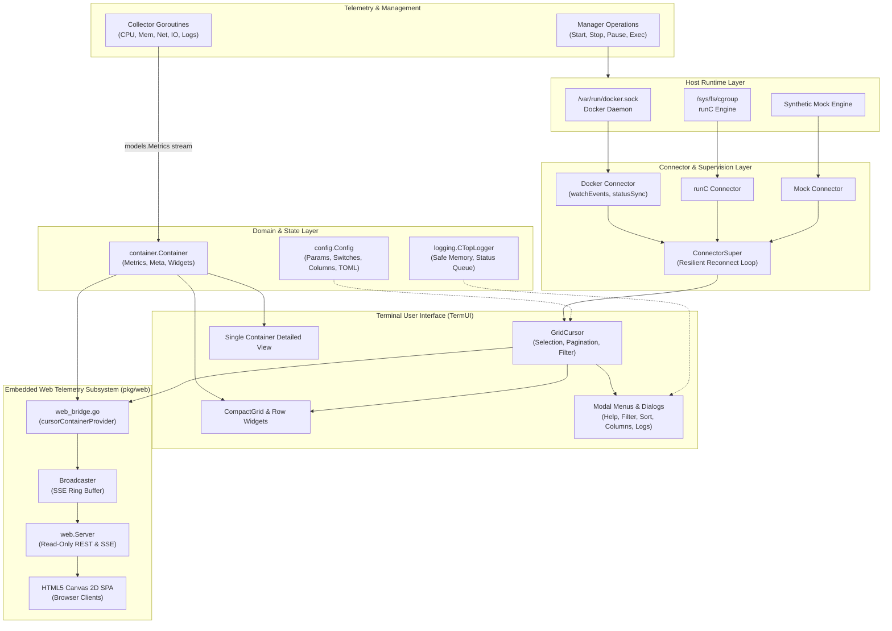

# ctop Architecture

## 1. Application Overview and Objectives

`ctop` is a command-line tool that provides a concise and real-time overview of container metrics. It acts as a "top-like" interface for containers, allowing users to monitor CPU, memory, network, and I/O usage at a glance directly from their terminal.

The primary objectives of `ctop` are:
- **Real-Time Monitoring:** Provide a live, continuously updated view of container performance metrics.
- **Extensibility:** Support multiple container runtimes (e.g., Docker, runc) through a modular backend system.
- **Interactivity:** Allow users to sort, filter, and manage containers through an intuitive terminal user interface (TUI).
- **Lightweight:** Be a minimal, efficient tool that can run easily in various environments.

## 2. Architecture and Design Choices

`ctop` is built with a modular and concurrent architecture to keep the UI responsive while collecting data from multiple sources in the background.



### Core Components

#### a. Connector Interface (`pkg/connector/`)
The most critical design choice is the `Connector` interface, which decouples the core application from the container backend. This allows `ctop` to support different container runtimes by providing a specific implementation for each.

- **`Connector` Interface (`pkg/connector/main.go`):** Defines the essential methods a backend must provide, such as `All()` to list containers, `Get()` to retrieve a specific container, and `Wait()` to block until disconnect.
- **`ConnectorSuper` (`pkg/connector/main.go`):** A wrapper that provides resilient connection logic, including initial connection and automatic retries on failure.
- **Docker Context Resolution (`pkg/connector/docker_context.go`):** Automatically detects and parses Docker CLI contexts from `DOCKER_CONTEXT`, `~/.docker/config.json` (`currentContext`), and `~/.docker/contexts/meta/<sha256>/meta.json` to seamlessly connect to Colima, Rancher Desktop, or Docker Desktop sockets.
- **Multi-Host Aggregation (`pkg/connector/multi.go`):** Implements `MultiConnector` to aggregate containers from multiple Docker endpoints (`--host local`, `--host tcp://...`, `--host ssh://...`) into a unified registry with dynamic host identification.
- **Implementations:**
    - `pkg/connector/docker.go`: The implementation for the Docker engine with real-time daemon event listening and TLS/mTLS authentication.
    - `pkg/connector/runc.go`: The implementation for runc utilizing libcontainer and host cgroups.
    - `pkg/connector/mock.go`: A thread-safe mock implementation used for development, benchmarks, and testing.

#### b. Data Model & Filtering (`pkg/container/` and `pkg/models/`)
The data is structured logically to separate the container's identity from its metrics and metadata.

- **`container.Container` (`pkg/container/main.go`, `pkg/container/sort.go`):** The central data structure representing a single container. It holds metadata (`Meta`), latest telemetry (`Metrics`), host ID, and references to its specific `Collector`, `Manager`, and visual `CompactRow` widgets.
- **Structured Multi-Field Filtering (`pkg/container/sort.go`):** Evaluates search expressions combining substring/regex tokens with key-value qualifiers (`status=`, `health=`, `name=`, `image=`, `env=`, labels) using space-separated AND logic.
- **`pkg/models/`:** Defines domain structures for `Metrics` (CPU, memory, net, I/O, PIDs), `Meta` (name, image, state, etc.), and `Log` lines. Includes **`models.EMA`** (Exponential Moving Average filter) for smoothing high-frequency telemetry fluctuations.

#### c. Data Collection and Management (`pkg/connector/collector/` and `pkg/connector/manager/`)
Each container's lifecycle and data streams are handled by dedicated components.

- **`Collector` (`pkg/connector/collector/`):** Responsible for collecting metrics for a single container (`docker.go`, `docker_logs.go`, `runc.go`, `mock.go`). Collectors run in dedicated goroutines per container, streaming `models.Metrics` and `models.Log` structures over channels. Supports cgroups v2 `io.stat` fallback and real-time throughput rate calculations.
- **`Manager` (`pkg/connector/manager/`):** Provides an interface for performing lifecycle actions on a container, such as `Start()`, `Stop()`, `Pause()`, `Unpause()`, `Restart()`, `Kill()`, `UpdateResources()`, `Download()`, `Upload()`, and `Exec()`.

#### d. Configuration Subsystem (`pkg/config/`)
- **`pkg/config/main.go` & `pkg/config/file.go`:** Manages thread-safe runtime parameters (`filterStr`, `sortField`), boolean switches (`allContainers`, `sortReversed`, `rateMode`), column ordering, and TOML configuration file persistence (`~/.config/ctop/config`).

#### e. Structured Logging Subsystem (`pkg/logging/`)
- **`pkg/logging/main.go` & `pkg/logging/server.go`:** Provides synchronized memory ring buffer logging, UI status line notification queues, and optional remote socket streaming (UNIX domain socket and TCP listeners).

#### f. Standalone Utilities (`pkg/*`)
- **`pkg/generator`:** Programmatic `docker run` command and `docker-compose.yml` specification generator from container metadata.
- **`pkg/prober`:** Non-blocking TCP network reachability prober with round-trip connection latency tracking.
- **`pkg/diag`:** Container state reflection introspector, diagnostic state dumps, and JSON snapshot exporters.
- **`pkg/jsonfmt`:** Structured JSON log parser that detects and formats JSON log payloads into aligned key-value pairs while preserving non-JSON logs.
- **`pkg/update`:** Self-update engine providing GitHub release discovery, OS/architecture asset matching, and atomic in-place binary upgrades (`ctop update`).
- **`pkg/keys`:** Abstract keyboard bindings mapping keys to logical actions (`up`, `down`, `pgup`, `pgdown`, `exit`, `help`, `enter`).
- **`pkg/sanitize`:** ANSI and OSC escape code stripping regex for log output.
- **`pkg/exit`:** POSIX-compliant application exit codes.

#### g. Terminal User Interface (`internal/*`)
The TUI is built using the `termui` library and is composed of several custom internal widgets:

- **`grid.go`:** Manages the main display, layout calculations, terminal resize synchronization, error views, and the primary event loop.
- **`cursor.go`:** Manages active container selection, row navigation, clamping, and viewport scrolling pagination.
- **`internal/cwidgets/`:** Contains custom reusable UI components: compact grid rows (`internal/cwidgets/compact/`) and detailed single-container views with sparklines and history ring buffers (`internal/cwidgets/single/`).
- **`internal/widgets/` & `internal/widgets/menu/`:** Custom presentation components including headers (`CTopHeader`), status bars (`StatusLine`), error screens (`ErrorView`), text views (`TextView`), prompt inputs (`Input`), and modal menus (`Menu`).
- **`internal/theme/`:** Centralizes TermUI color maps, text styles, light/dark color map inversion, terminal sizing, and icon glyph engines (Unicode and Nerd Fonts).
- **`menus.go`:** Defines interactive dialogs for Help, Filter, Sort, Columns, Container actions, and Shell execution.

#### h. Embedded Web Telemetry & SSE Server (`pkg/web/` and `web_bridge.go`)
`ctop` provides a zero-dependency, real-time embedded web telemetry server and browser dashboard accessible via the `--web <address>` CLI option:

- **`web_bridge.go` (`cursorContainerProvider`):** Bridges runtime domain models (`GridCursor`, `Container`) to the web subsystem. Converts live container metrics into immutable `web.ContainerSnapshot` representations using `c.RLock()`.
- **Automatic Secret & Credential Sanitizer (`pkg/sanitize`):** Filters out sensitive environment variables and labels matching password/token/key patterns before serialization to guarantee zero credential exposure on web dashboards.
- **SSE Broadcaster (`pkg/web/broadcaster.go`):** High-throughput, non-blocking Server-Sent Events hub streaming point-in-time telemetry (`/api/v1/stream`) to connected browser clients with automatic keepalives.
- **Embedded SPA Dashboard (`pkg/web/dashboard.html`):** Single-page web application embedded via `//go:embed`. Features dark glassmorphism styling, live container metrics overview, search filtering, rate mode toggle, real-time HTML5 Canvas 2D telemetry sparklines, downloadable pretty-formatted JSON export buttons, clipboard plain-text report copy buttons, and a per-container drill-down inspection modal with live CPU/memory/network/disk graphs, a 5-row running metric history table, and inspect tabs (`[o] overview & metrics`, `[v] volumes & mounts`, `[n] networking & ports`, `[E] process & env`, `[P] in-container top`).
- **Read-Only REST API & Reverse Proxy Routing (`pkg/web/server.go`):** Exposes `/api/v1/health`, `/api/v1/metrics`, `/api/v1/containers`, `/api/v1/containers/{id}`, `/api/v1/containers/{id}/top`, and `/api/v1/export` (supporting cluster and `?container=<id>` pretty JSON downloads). Supports subpath prefixing via `--url-prefix <subpath>` (e.g. `/probe`) for seamless NGINX, Caddy, or Traefik reverse proxy integration. Strictly enforces read-only access (rejects `POST`/`PUT`/`DELETE` with 405 Method Not Allowed; exposes zero Docker mutator or exec commands).
- **Headless Daemon Mode (`--headless`):** Allows running `ctop` purely as a background telemetry server (e.g. within Docker or systemd) without initializing terminal UI libraries.

### Concurrency and Thread Safety Model
`ctop` is heavily concurrent to ensure a non-blocking, sub-millisecond UI response time:
- The **main goroutine** drives UI rendering and user keyboard/resize event dispatching.
- Each container's **collector runs in an independent goroutine**, continuously fetching metrics and streaming them across buffered channels.
- The active **connector runs an event-watching goroutine** in the background listening to daemon socket events (`start`, `pause`, `die`, `destroy`) to update container registries without polling.
- The **web telemetry loop** ticks every 1 second, querying snapshots only when active SSE subscribers exist (`broadcaster.SubscriberCount() > 0`) to ensure 0 CPU overhead when idle.
- **Thread Safety Mechanisms**:
  - `container.Container`: Protected by `sync.RWMutex` to allow concurrent telemetry updates while rendering.
  - `logging.safeMemoryBackend`: Protected by internal mutex preventing race conditions during concurrent log writes.
  - `widgets.TextView`: Uses a dedicated `mu sync.Mutex` separating widget text buffering from `termui.Block` rendering.
  - `menus.LogMenu`: Uses buffered channels with non-blocking select sends to guarantee zero hangs on closing.
  - `theme.TermDimensions()`: Evaluates `tb.IsInit` to ensure crash-free execution in headless test and CI environments.

## 3. Application Lifecycle & Graceful Termination

```mermaid
sequenceDiagram
    autonumber
    participant CLI as main() Entry
    participant Cfg as config.Config
    participant Conn as connector.ConnectorSuper
    participant TUI as termui / GridCursor
    participant Log as logging.CTopLogger

    CLI->>Log: Initialize diagnostic logger (safeMemoryBackend)
    CLI->>Cfg: Load defaults & read ~/.config/ctop/config
    CLI->>Conn: Initialize connector (Docker / Context / MultiHost / runC / Mock)
    CLI->>TUI: Initialize termbox & bind resize/keyboard event loop
    
    rect rgb(30, 40, 60)
        Note over Conn,TUI: Real-Time Event Loop & Telemetry Streaming
        Conn->>TUI: Stream metrics & container lifecycle events
        TUI->>TUI: Render compact rows & inspector views
    end

    CLI->>TUI: Capture termination signal / 'q' key
    TUI->>Conn: Signal collector & event watcher cancellation
    TUI->>CLI: Shutdown() -> Restore terminal mode & show cursor
    CLI->>Log: Flush status queue & exit cleanly (exit.ExitSuccess)
```



---

## 4. Full Module & Package Hierarchy

```text
ctop/
├── main.go                       # CLI entry point: flag parsing (--rate, --cumulative, --tls-*, --icons, etc.), theme init, main loop
├── grid.go                       # Core layout engine, termbox event handler, and terminal resize listener
├── cursor.go                     # GridCursor model: container selection, pagination, scrolling, and active index tracking
├── menus.go                      # Interactive modal menu handlers (Help, Filter, Sort, Columns, Container actions, Shell execution)
├── debug.go                      # Diagnostic event logger and runtime state dumper
├── web_bridge.go                 # Telemetry bridge between GridCursor and embedded web server
├── colors.go                     # Inverted color map calculations for light/dark terminal backgrounds
│
├── pkg/                          # Public Headless Libraries & Programmatic SDK
│   ├── web/                      # Embedded real-time HTTP server, REST telemetry APIs, and SSE stream
│   │   ├── server.go             # Strictly read-only HTTP server & REST endpoint multiplexer
│   │   ├── broadcaster.go        # High-throughput non-blocking Server-Sent Events (SSE) distributor
│   │   ├── types.go              # Telemetry event schemas & container snapshot models
│   │   └── dashboard.html        # Embedded zero-dependency HTML5 Canvas 2D telemetry dashboard
│   │
│   ├── connector/                # Modular container runtime engine connectors
│   │   ├── main.go               # Connector interface, ConnectorSuper supervisor with reconnect backoff
│   │   ├── docker.go             # Docker daemon connector, TLS/mTLS configuration, client certificate loading
│   │   ├── docker_context.go     # Automatic Docker context discovery (Colima, Rancher, Docker Desktop)
│   │   ├── multi.go              # Multi-host Docker aggregator for unified multi-node telemetry
│   │   ├── runc.go               # runC container runtime connector using libcontainer and cgroups
│   │   ├── mock.go               # Synthetic mock connector for headless simulation and CI testing
│   │   ├── collector/            # Real-time container telemetry streaming collectors
│   │   │   ├── main.go           # Collector and LogCollector interfaces
│   │   │   ├── docker.go         # Docker stats collector: CPU, mem breakdown, EMA rates, cgroups v2 io.stat fallback
│   │   │   ├── docker_logs.go    # Docker stdio multiplex header parser and timestamp extractor
│   │   │   ├── runc.go           # runC cgroup metric sampler
│   │   │   ├── proc.go           # Process state inspector and CPU percentage calculators
│   │   │   └── mock.go           # Simulated metric generator producing realistic fluctuating workloads
│   │   └── manager/              # Container lifecycle management controllers
│   │       ├── main.go           # Manager interface definition (Start, Stop, Pause, Restart, Exec, Resources)
│   │       ├── docker.go         # Docker SDK lifecycle manager: exec sessions, file upload/download, resource hot-tuning
│   │       ├── runc.go           # runC signal and lifecycle dispatcher
│   │       └── mock.go           # Simulated container lifecycle state machine
│   │
│   ├── container/                # Domain container model, filtering, and sorting engine
│   │   ├── main.go               # Container struct: encapsulates metrics, metadata, widgets, and collectors
│   │   └── sort.go               # Sorters (CPU, mem, net, I/O, PIDs, uptime) and structured multi-field filter parser
│   │
│   ├── models/                   # Core domain data types and mathematical filters
│   │   └── main.go               # Metrics (CPU, memory, net, I/O, rates), Meta, Log, TopResult, Change, and EMA smoothing filter
│   │
│   ├── config/                   # Configuration parameters, switches, and TOML persistence
│   │   ├── main.go               # Global configuration store, parameter and switch getters/setters
│   │   ├── param.go              # String/integer runtime parameters (filterStr, sortField, downloadDir, icons)
│   │   ├── switch.go             # Boolean switches (rateMode, allContainers, sortReversed, fullRowCursor, enableHeader)
│   │   ├── columns.go            # Column ordering, column toggle/shift logic, and default visibility
│   │   └── file.go               # TOML configuration file loader and persistent writer (~/.config/ctop/config)
│   │
│   ├── logging/                  # Thread-safe ring buffer logger and remote streaming daemon
│   │   ├── main.go               # CTopLogger: synchronized memory buffer, UI status line event queue
│   │   └── server.go             # UNIX domain socket and TCP listener log streaming servers (port :9000)
│   │
│   ├── generator/                # Container specification and CLI command generators
│   │   └── generator.go          # Programmatic `docker run` command and `docker-compose.yml` service spec generator
│   │
│   ├── prober/                   # Non-blocking network reachability diagnostic engine
│   │   └── prober.go             # Parallel TCP dialer probing external host ports and container internal endpoints
│   │
│   ├── diag/                     # Introspection, state dumps, and JSON snapshot exporters
│   │   └── diag.go               # Reflection struct introspector, formatted state dumps, and JSON serializers
│   │
│   ├── jsonfmt/                  # Structured JSON log formatting engine
│   │   └── jsonfmt.go            # JSON log detector, field alignment, and key-value syntax highlighter
│   │
│   ├── update/                   # Self-update engine and GitHub release asset manager
│   │   └── update.go             # GitHub release API client, platform binary matcher, checksum verifier, and in-place replacer
│   │
│   ├── keys/                     # Abstract keyboard sequence parser
│   │   └── keys.go               # Key sequence matcher mapping TermBox keys to logical UI actions
│   │
│   ├── sanitize/                 # String sanitization & secret masking utilities
│   │   └── sanitize.go           # Regex ANSI CSI/OSC escape stripper and sensitive secret key masking (passwords, tokens, keys)
│   │
│   └── exit/                     # POSIX process termination exit codes
│       └── exit.go               # Standardized exit codes (ExitSuccess, ExitUsage, ExitUI, ExitConnector, ExitGeneral)
│
├── internal/                     # Private Terminal User Interface (TUI) Packages
│   ├── cwidgets/                 # Custom termui container visualization widgets
│   │   ├── main.go               # WidgetUpdater interface definition
│   │   ├── util.go               # Byte and metric unit formatting utilities (KB, MB, GB, Short format)
│   │   ├── compact/              # High-density multi-container overview grid
│   │   │   ├── grid.go           # CompactGrid widget: row layout, spacing, dynamic header rebuilding, divider rendering
│   │   │   ├── row.go            # CompactRow: container row widget container, highlighting, and sub-widget layout
│   │   │   ├── header.go         # Grid header bar displaying column titles and dynamic mode indicators
│   │   │   ├── column.go         # Column abstraction and column widget registry
│   │   │   ├── text.go           # TextCol, MetaCol, CIDCol, ImageCol, CreatedCol, NetCol (Rx/Tx), IOCol (Reads/Writes), PIDCol, UptimeCol
│   │   │   ├── gauge.go          # CPUCol, CpuScaledCol, MemCol (MEM Alloc / Total with adaptive color scales)
│   │   │   ├── status.go         # Status glyph column with color-coded operational state icons
│   │   │   └── util.go           # Compact row width and coordinate alignment helpers
│   │   └── single/               # 9-Tab detailed single-container inspector view
│   │       ├── main.go           # Single view controller, tab navigation, scroll bounds clamping, key delegation
│   │       ├── tabbar.go         # Tab selection bar with tab indices [1..9]
│   │       ├── cpu.go            # CPU utilization gauge and historical sparkline chart
│   │       ├── mem.go            # Memory usage gauge, RSS/Cache/Swap breakdown, and historical sparkline chart
│   │       ├── net.go            # Network Rx/Tx volume gauges and transfer rate sparklines
│   │       ├── io.go             # Disk I/O Read/Write volume gauges and transfer rate sparklines
│   │       ├── info.go           # Container metadata property sheet (IPs, ports, image, created, health)
│   │       ├── mounts.go         # Storage volumes and mount bindings table (destination, source, type, mode)
│   │       ├── network.go        # Network adapters table, port bindings, and live TCP reachability prober
│   │       ├── process.go        # Linux capabilities, security options, and environment variables with secret masking
│   │       ├── top.go            # In-container live process table viewer (PID, USER, TIME, COMMAND)
│   │       ├── diff.go           # Writable filesystem layer changes table (Added, Changed, Deleted)
│   │       ├── generator.go      # Equivalent `docker run` command and `docker-compose.yml` snippet display
│   │       ├── explorer.go       # In-container interactive file explorer with download and viewing capabilities
│   │       ├── logs.go           # Live log stream viewer with timestamp toggle, keyword filter, and export
│   │       ├── labels.go         # Container label key-value table viewer
│   │       └── hist.go           # Rolling circular ring buffer for sparkline telemetry history
│   │
│   ├── widgets/                  # General-purpose TUI presentation components
│   │   ├── header.go             # CTopHeader: global title, time, container counts, active filter indicator
│   │   ├── status.go             # StatusLine: bottom notification and error message bar
│   │   ├── error.go              # ErrorView: full-screen modal error alert box
│   │   ├── input.go              # Input: interactive single-line text input prompt
│   │   ├── view.go               # TextView: scrollable text viewport with ANSI sanitization
│   │   └── menu/                 # Modal selection dialogs
│   │       ├── main.go           # Menu widget: selectable list, keyboard navigation, dynamic filtering
│   │       ├── items.go          # Menu item models and item constructor helpers
│   │       └── tooltip.go        # Contextual hotkey helper tooltip drawer
│   │
│   └── theme/                    # Color palette and typographic style management
│       ├── theme.go              # TermUI color definitions, style attributes, light/dark color map inversion, terminal sync
│       └── icons.go              # Icon glyph system supporting standard Unicode runes and modern Nerd Font symbols
│
└── integration/                  # Live Docker Daemon E2E Integration Test Suite
    └── docker_integration_test.go# 100% real-world Docker workflow integration tests (spawning, streaming, exec, mTLS, rates)
```

---

For complete user-facing CLI options, command-line arguments, environment variables, and usage examples, refer to the [README.md](README.md).
