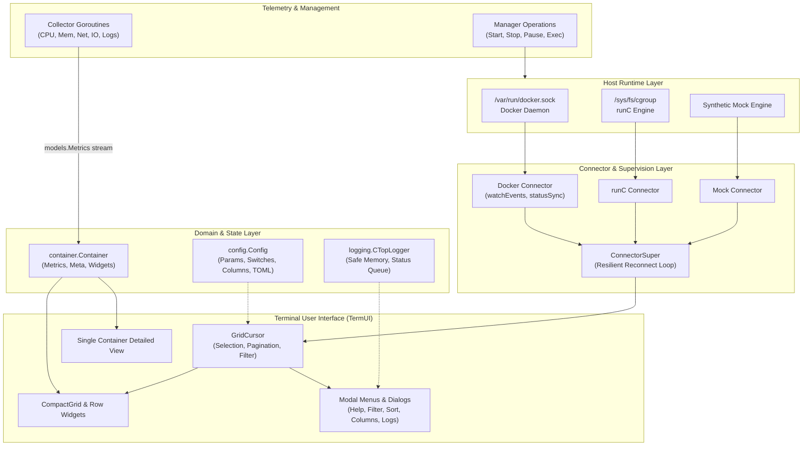

# ctop Architecture

## 1. Application Overview and Objectives

`ctop` is a command-line tool that provides a concise and real-time overview of container metrics. It acts as a "top-like" interface for containers, allowing users to monitor CPU, memory, network, and I/O usage at a glance directly from their terminal.

The primary objectives of `ctop` are:
- **Real-Time Monitoring:** Provide a live, continuously updated view of container performance metrics.
- **Extensibility:** Support multiple container runtimes (e.g., Docker, runc) through a modular backend system.
- **Interactivity:** Allow users to sort, filter, and manage containers through an intuitive terminal user interface (TUI).
- **Lightweight:** Be a minimal, efficient tool that can run easily in various environments.

## 2. Architecture and Design Choices

`ctop` is built with a modular and concurrent architecture to keep the UI responsive while collecting data from multiple sources in the background.



### Core Components

#### a. Connector Interface
The most critical design choice is the `Connector` interface, which decouples the core application from the container backend. This allows `ctop` to support different container runtimes by providing a specific implementation for each.

- **`Connector` Interface (`connector/main.go`):** Defines the essential methods a backend must provide, such as `All()` to list containers, `Get()` to retrieve a specific container, and `Wait()` to block until disconnect.
- **`ConnectorSuper` (`connector/main.go`):** A wrapper that provides resilient connection logic, including initial connection and automatic retries on failure.
- **Implementations:**
    - `connector/docker.go`: The implementation for the Docker engine with real-time daemon event listening.
    - `connector/runc.go`: The implementation for runc utilizing libcontainer and host cgroups.
    - `connector/mock.go`: A thread-safe mock implementation used for development, benchmarks, and testing.

#### b. Data Model (`container/` and `models/`)
The data is structured logically to separate the container's identity from its metrics and metadata.

- **`container.Container` (`container/main.go`, `container/sort.go`):** The central data structure representing a single container. It holds metadata, the latest metrics, and references to its specific `Collector`, `Manager`, and visual `CompactRow` widgets.
- **`models/`:** This package defines the raw data structures for `Metrics` (CPU, memory, net, I/O, PIDs), `Meta` (name, image, state, etc.), and `Log` lines, ensuring clean separation of domain data from presentation logic.

#### c. Data Collection and Management (`collector/` and `manager/`)
Each container's lifecycle and data streams are handled by dedicated components.

- **`Collector` (`connector/collector/`):** Responsible for collecting metrics for a single container. Each connector type has a corresponding collector (`docker.go`, `docker_logs.go`, `runc.go`, `mock.go`). Collectors run in dedicated goroutines per container, streaming `models.Metrics` and `models.Log` structures over channels.
- **`Manager` (`connector/manager/`):** Provides an interface for performing lifecycle actions on a container, such as `Start()`, `Stop()`, `Pause()`, `Unpause()`, `Restart()`, and `Exec()`.

#### d. Configuration Subsystem (`config/`)
- **`config/main.go` & `config/file.go`:** Manages thread-safe runtime parameters (`filterStr`, `sortField`), boolean switches (`allContainers`, `sortReversed`), column ordering, and TOML configuration file persistence (`~/.config/ctop/config`).

#### e. Structured Logging Subsystem (`logging/`)
- **`logging/main.go` & `logging/server.go`:** Provides synchronized memory ring buffer logging, UI status line notification queues, and optional remote socket streaming (UNIX domain socket and TCP listeners).

#### f. Styling & Themes (`theme/` and `pkg/`)
- **`theme/theme.go`:** Centralizes TermUI color maps, text styles, light/dark color map inversion, and headless terminal sizing (`TermDimensions`, `SyncTerm`).
- **`pkg/keys`:** Abstract keyboard bindings mapping keys to logical actions (`up`, `down`, `pgup`, `pgdown`, `exit`, `help`, `enter`).
- **`pkg/sanitize`:** ANSI and OSC escape code stripping regex for log output.
- **`pkg/exit`:** POSIX-compliant application exit codes.

#### g. Terminal User Interface (TUI)
The TUI is built using the `termui` library and is composed of several custom widgets.

- **`grid.go`:** Manages the main display, layout calculations, terminal resize synchronization, error views, and the primary event loop.
- **`cursor.go`:** Manages active container selection, row navigation, clamping, and viewport scrolling pagination.
- **`cwidgets/`:** Contains custom reusable UI components: compact grid rows (`cwidgets/compact/`) and detailed single-container views with sparklines and history ring buffers (`cwidgets/single/`).
- **`widgets/` & `widgets/menu/`:** Custom presentation components including headers (`CTopHeader`), status bars (`StatusLine`), error screens (`ErrorView`), text views (`TextView`), prompt inputs (`Input`), and modal menus (`Menu`).
- **`menus.go`:** Defines interactive dialogs for Help, Filter, Sort, Columns, Container actions, and Shell execution.

### Concurrency and Thread Safety Model
`ctop` is heavily concurrent to ensure a non-blocking, sub-millisecond UI response time:
- The **main goroutine** drives UI rendering and user keyboard/resize event dispatching.
- Each container's **collector runs in an independent goroutine**, continuously fetching metrics and streaming them across buffered channels.
- The active **connector runs an event-watching goroutine** in the background listening to daemon socket events (`start`, `pause`, `die`, `destroy`) to update container registries without polling.
- **Thread Safety Mechanisms**:
  - `container.Container`: Protected by `sync.RWMutex` to allow concurrent telemetry updates while rendering.
  - `logging.safeMemoryBackend`: Protected by internal mutex preventing race conditions during concurrent log writes.
  - `widgets.TextView`: Uses a dedicated `mu sync.Mutex` separating widget text buffering from `termui.Block` rendering.
  - `menus.LogMenu`: Uses buffered channels with non-blocking select sends to guarantee zero hangs on closing.
  - `theme.TermDimensions()`: Evaluates `tb.IsInit` to ensure crash-free execution in headless test and CI environments.

## 3. Command-Line Arguments

`ctop` can be configured at startup using the following command-line flags.

| Flag | Type | Default | Description |
|---|---|---|---|
| `-v` | bool | `false` | Output version information and exit. |
| `-h` | bool | `false` | Display the help dialog and exit. |
| `-f` | string | `""` | Filter containers by name. |
| `-a` | bool | `false` | Show active containers only (by default, all containers are shown). |
| `-s` | string | `""` | Select the container sort field (e.g., `cpu`, `mem`, `name`). |
| `-r` | bool | `false` | Reverse the container sort order. |
| `-i` | bool | `false` | Invert the default colors for the UI. |
| `-connector` | string | `docker` | The container connector to use (e.g., `docker`, `runc`). |

## 4. Examples on How to Use

**Run with default settings (Docker connector, show all containers):**
```bash
ctop
```

**Show only running containers:**
```bash
ctop -a
```

**Filter containers by name (e.g., only show containers with "app" in the name):**
```bash
ctop -f app
```

**Sort containers by CPU usage in descending order:**
```bash
ctop -s cpu -r
```

**Use the runc connector instead of Docker:**
```bash
ctop -connector runc
```
