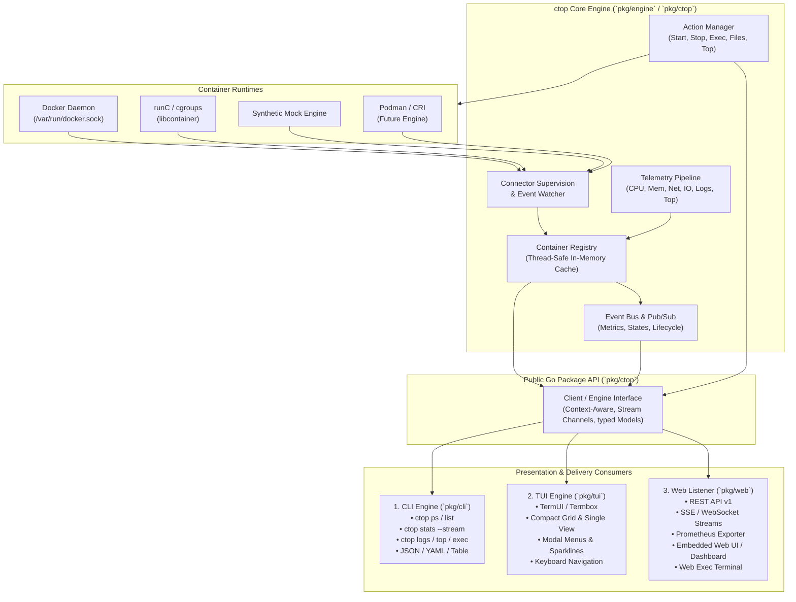
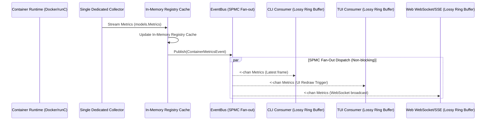
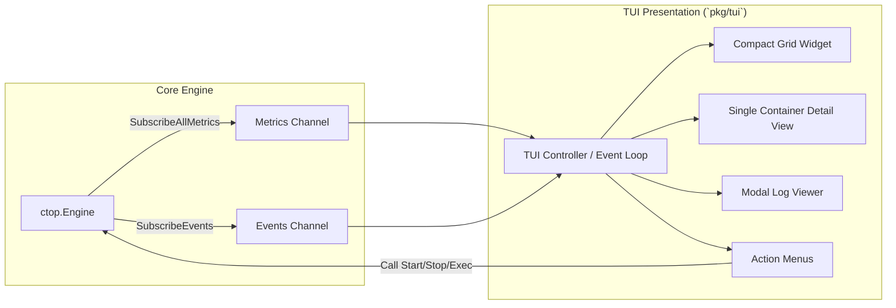
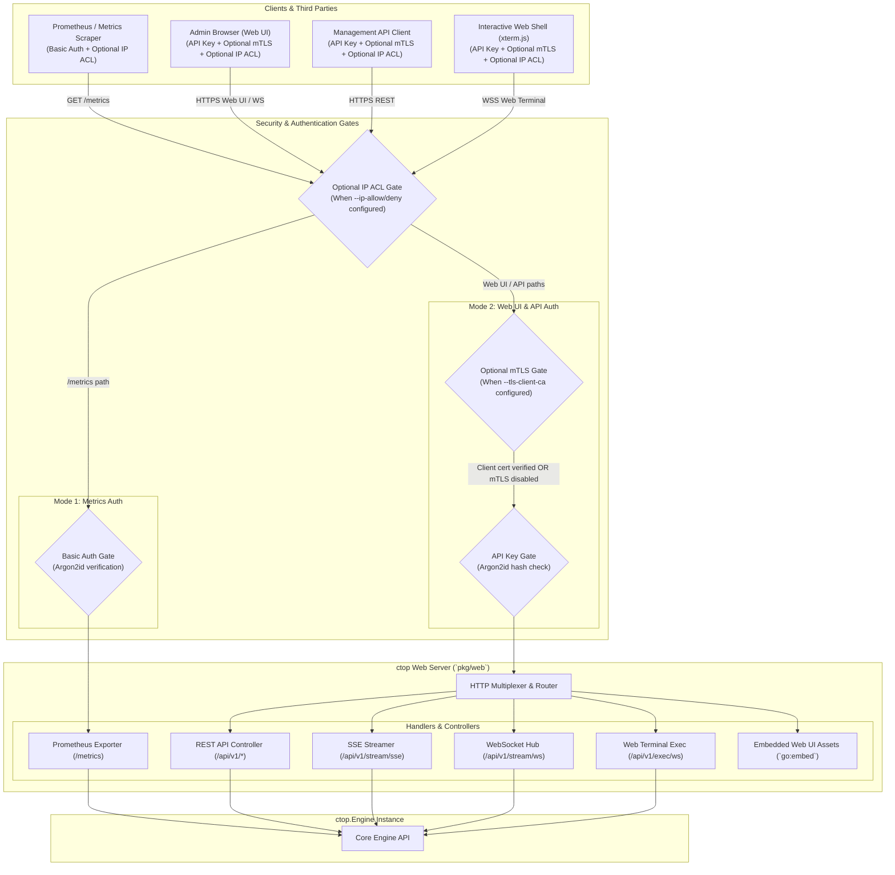
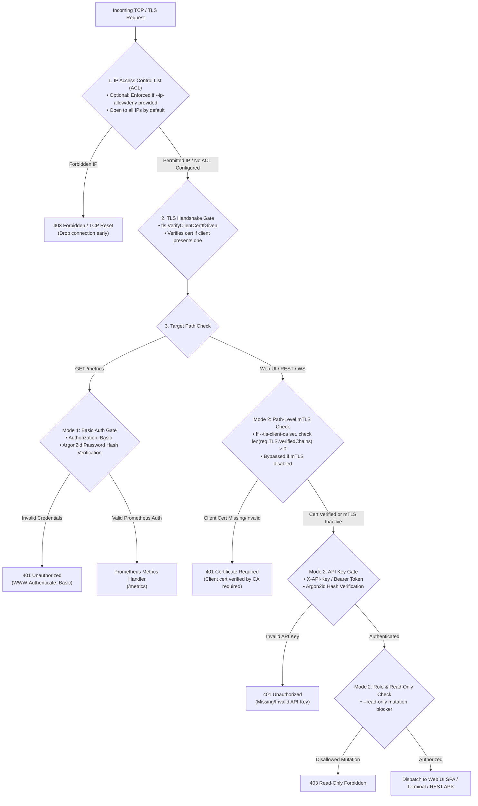
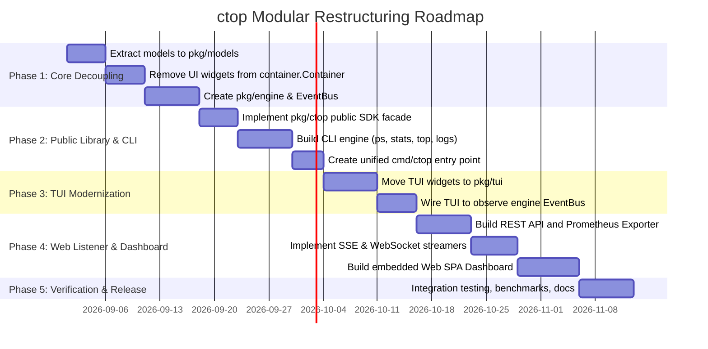

# Architecture & Restructuring Design: ctop as a Modular Go Package Engine

## 1. Executive Summary & Objectives

`ctop` has historically functioned as a dedicated terminal-based container metrics monitor built tightly around `termui` and `termbox-go`. While efficient for interactive terminal use, the core logic (container discovery, telemetry collection, event stream aggregation, and lifecycle control) is tightly coupled with presentation widgets and global configuration singletons.

This document establishes the architectural blueprint to restructure `ctop` into a **headless, high-performance, general-purpose Go library/package engine**. This engine can be consumed independently by three first-class presentation layers:

1. **CLI (Command Line Interface)**: Scriptable, pipe-friendly, non-interactive snapshots, continuous NDJSON/CSV/Table streams, and container management subcommands.
2. **TUI (Terminal User Interface)**: Rich, interactive, low-latency terminal interface with sparklines, menus, shell exec, and container navigation (modernized from existing UI).
3. **Web Listener (HTTP / REST / WebSocket / SSE / Embedded Web Dashboard)**: Remote daemon exposing REST APIs, real-time telemetry streaming over WebSockets/SSE, Prometheus metric scraping, interactive web terminal, and a self-contained embedded web GUI.



---

## 2. Current Architecture vs. Target Architecture

### 2.1 Problem Analysis of Current Architecture

1. **Domain Entities Bound to UI Widgets**: The `container.Container` struct in [container/main.go](container/main.go) directly embeds `Widgets *compact.CompactRow` and `updater cwidgets.WidgetUpdater`. A background metric read modifies UI widget state directly, making it impossible to use `ctop` without importing UI drawing code.
2. **Global Singletons**: Configuration ([config/main.go](config/main.go)), logging ([logging/main.go](logging/main.go)), and UI coordinate states are managed via global variables, preventing multiple concurrent engine instances or multi-tenant server sessions.
3. **No Command-Line Separation**: `main.go` resides in the repository root and immediately initializes `termui.Init()`. There is no separation between the application entry point and package logic.
4. **Tight Event Coupling**: Terminal keyboard events in `grid.go` drive data fetching synchronously rather than observing an decoupled telemetry stream.

### 2.2 Architectural Comparison

| Dimension | Current Architecture | Target Modular Architecture |
|---|---|---|
| **Package Classification** | Monolithic binary (`package main`) | Headless Library (`pkg/engine`) + Modular Consumers (`pkg/cli`, `pkg/tui`, `pkg/web`) |
| **Domain Model (`Container`)** | Contains TermUI widgets & drawing methods | Pure Go struct containing metadata, metrics, and state channels |
| **Configuration** | Global package variables with TOML persistence | Typed `Config` struct / functional options with per-instance isolation |
| **Output Capabilities** | Interactive terminal (TermUI) only | Terminal TUI, CLI (Table/JSON/YAML), REST API, WebSockets, SSE, Web Dashboard |
| **Extensibility** | UI and backend coupled | Pluggable connectors, pluggable sinks, and clean Go SDK interfaces |
| **Concurrency Model** | Goroutine per container writing directly to widgets | Goroutine per container publishing to a multiplexed Pub/Sub EventBus |

### 2.3 Runtime Connector & Cross-Platform Support Matrix

`ctop` unifies multiple container execution backends under a standard `connector.Connector` interface:

| Runtime Backend | Target Platform | Supported Connection Endpoints | Notes |
|---|---|---|---|
| **Docker Engine** | Linux, macOS, Windows | Unix Socket (`/var/run/docker.sock`), Windows Named Pipe (`//./pipe/docker_engine`), Remote TCP (`tcp://host:2376`), SSH Tunnel (`ssh://user@host`) | Supports `DOCKER_HOST`, `DOCKER_TLS_VERIFY`, `DOCKER_CERT_PATH` |
| **runC (Direct cgroups)**| Linux only | Linux cgroups v1 (`/sys/fs/cgroup/*`) and cgroups v2 (`/sys/fs/cgroup/cgroup.controllers`) | Direct kernel metrics without Docker daemon overhead |
| **Podman / CRI** | Linux, macOS | Podman API Socket (`/run/user/$UID/podman/podman.sock` or `unix:///run/podman/podman.sock`) | Docker-compatible REST emulation |
| **Mock Engine** | All OS Platforms | In-memory synthetic telemetry generator | Used for CI/CD, unit testing, and load benchmarking |

---

## 3. Core Engine Architecture (`pkg/engine` & `pkg/ctop`)

The core engine is completely independent of presentation libraries. It has zero dependencies on `termui`, `termbox-go`, or HTML templates.

### 3.1 Core Interfaces

```go
package ctop

import (
    "context"
    "io"
    "time"

    "github.com/edsilegx/ctop/models"
)

// Engine is the central interface for discovering, monitoring, and managing containers.
type Engine interface {
    // Lifecycle
    Start(ctx context.Context) error
    Close() error
    Wait() <-chan struct{}

    // Query & Discovery
    ListContainers(ctx context.Context, filter ContainerFilter) ([]*models.ContainerInfo, error)
    GetContainer(ctx context.Context, id string) (*models.ContainerInfo, error)

    // Real-Time Telemetry & Event Streaming
    SubscribeEvents(ctx context.Context) (<-chan models.ContainerEvent, error)
    SubscribeMetrics(ctx context.Context, containerID string) (<-chan models.Metrics, error)
    SubscribeAllMetrics(ctx context.Context) (<-chan models.ContainerMetricsEvent, error)
    StreamLogs(ctx context.Context, id string, opts LogOptions) (<-chan models.Log, error)

    // Container Management & Actions
    StartContainer(ctx context.Context, id string) error
    StopContainer(ctx context.Context, id string) error
    PauseContainer(ctx context.Context, id string) error
    UnpauseContainer(ctx context.Context, id string) error
    RestartContainer(ctx context.Context, id string) error
    RemoveContainer(ctx context.Context, id string) error
    SignalContainer(ctx context.Context, id string, sig string) error

    // Diagnostic & Inspection Operations
    Top(ctx context.Context, id string) (models.TopResult, error)
    Changes(ctx context.Context, id string) ([]models.Change, error)
    ReadDir(ctx context.Context, id string, path string) ([]models.FileInfo, error)
    ReadFile(ctx context.Context, id string, path string, maxBytes int64) (string, error)
    Download(ctx context.Context, id string, srcPath string, dstWriter io.Writer) (int64, error)
    Upload(ctx context.Context, id string, srcReader io.Reader, dstPath string) error
    UpdateResources(ctx context.Context, id string, res ResourceLimits) error
    Exec(ctx context.Context, id string, cmd []string, stream ExecStream) error

    // Code & Config Generation
    GenerateRunCmd(ctx context.Context, id string) (string, error)
    GenerateCompose(ctx context.Context, id string) (string, error)
}
```

### 3.2 Decoupled Data Models (`pkg/models`)

The domain models are freed from UI bindings:

```go
package models

import "time"

// ContainerInfo represents the complete static and dynamic state of a container.
type ContainerInfo struct {
    ID           string            `json:"id"`
    Name         string            `json:"name"`
    Image        string            `json:"image"`
    State        string            `json:"state"`
    Status       string            `json:"status"`
    Created      time.Time         `json:"created"`
    IP           string            `json:"ip"`
    Ports        []PortMapping     `json:"ports"`
    Mounts       []MountInfo       `json:"mounts"`
    Env          map[string]string `json:"env,omitempty"`
    Metrics      Metrics           `json:"metrics"`
    Limits       ResourceLimits    `json:"limits"`
    RestartCount int               `json:"restart_count"`
}

// ContainerEvent broadcasts runtime state changes across the system.
type ContainerEventType string

const (
    EventCreated ContainerEventType = "created"
    EventStarted ContainerEventType = "started"
    EventStopped ContainerEventType = "stopped"
    EventPaused  ContainerEventType = "paused"
    EventDied    ContainerEventType = "died"
    EventRemoved ContainerEventType = "removed"
    EventUpdated ContainerEventType = "updated"
)

type ContainerEvent struct {
    Type        ContainerEventType `json:"type"`
    ContainerID string             `json:"container_id"`
    Timestamp   time.Time          `json:"timestamp"`
    Attributes  map[string]string  `json:"attributes,omitempty"`
}

type ContainerMetricsEvent struct {
    ContainerID string    `json:"container_id"`
    Timestamp   time.Time `json:"timestamp"`
    Metrics     Metrics   `json:"metrics"`
}
```

### 3.3 The EventBus Subsystem & Telemetry Pipeline

To efficiently feed CLI streams, TUI redraw loops, Prometheus scrapers, and WebSockets concurrently, `ctop` implements a **Single-Producer, Multi-Consumer (SPMC)** architecture paired with a lock-free fan-out `EventBus`:



#### 1. Single-Producer, Multi-Consumer (SPMC) Architecture
- **Single Source of Truth**: Exactly **one** collector goroutine runs per active container regardless of whether 0, 1, or 50 clients (CLI, TUI, web sessions, Prometheus scrapers) are connected.
- **Resource Optimization**: Prevents redundant Docker engine API socket calls or duplicated cgroup filesystem reads.
- **Shared In-Memory Cache**: Container metadata and metric snapshots are updated in an RCU (Read-Copy-Update) protected `Registry`, making query operations (`GET /api/v1/containers`, `/metrics`, `ctop ps`) sub-millisecond memory reads.

#### 2. Non-Blocking Lossy Ring Buffer Backpressure
To prevent slow network clients (e.g., a high-latency mobile browser on WebSockets) from stalling core telemetry collection or causing unbounded heap allocations:
- Each consumer channel utilizes a bounded ring buffer (default capacity: 64 frames).
- Pushes execute with non-blocking dropping semantics:
  ```go
  select {
  case sub.ch <- event:
      // Pushed successfully
  default:
      // Channel full: drop oldest frame to preserve latest real-time telemetry
      select {
      case <-sub.ch:
      default:
      }
      sub.ch <- event
  }
  ```
- Guaranteed zero backpressure propagation back to container collectors or runtime drivers.

---

## 4. Consumer 1: The CLI Subsystem (`pkg/cli`)

The CLI consumer provides scriptable, pipeable, interactive, and non-interactive workflows for automation, CI/CD, scripting, and fast terminal operations, providing **100% feature parity with all TUI capabilities**.

### 4.1 CLI Capabilities & Command Matrix

```
ctop [global-flags] <command> [command-flags] [arguments...]
```

#### Global Flags:
- `--connector <docker|runc|mock>`: Target container runtime backend (default: `docker`).
- `-H, --host <uri>`: Daemon socket/TCP URI (e.g. `unix:///var/run/docker.sock`, `tcp://127.0.0.1:2376`, `npipe:////./pipe/docker_engine`, or via `DOCKER_HOST`).
- `--read-only`, `-ro`: Read-only enforcement mode (blocks destructive lifecycle actions).
- `-f, --filter <str>`: Filter containers by name, id, or image substring.
- `-a, --all`: Include non-running containers (by default, only active/running are monitored in stats).
- `--json`, `--yaml`, `--ndjson`: Global output format shortcuts.
- `-q, --quiet`: Only display container IDs.
- `--no-color`: Suppress ANSI color escape codes (auto-enabled when stdout is not a TTY).

#### TTY Auto-Detection & Unix Pipeline Ergonomics:
- **Interactive Terminal (TTY)**: When connected to a terminal, commands like `ctop stats` default to live multi-container streaming with in-place ANSI cursor refreshing and colorized status gauges.
- **Piped / Non-TTY Output**: When stdout is redirected to a pipe, file, or CI/CD script (e.g. `ctop stats | grep redis` or `ctop stats > stats.txt`), `ctop` automatically detects non-TTY mode, suppresses ANSI escape codes, and executes in **single-snapshot mode (`--no-stream`)** by default. Continuous streaming in pipes can be explicitly forced with `--format ndjson` or `-f, --follow`.

---

### 4.2 Comprehensive Subcommands (Full TUI Parity)

#### 1. Container Listing & Filtering (`ctop ps` / `ctop list`)
*Corresponds to TUI Main Grid, Column Selection (`c`), Filter (`/`), Sort (`s`), and Reversed Sort (`r`).*
- **Usage**: `ctop ps [flags]`
- **Flags**:
  - `-a, --all`: Show all containers (running, paused, stopped).
  - `-f, --filter <expr>`: Filter by name, ID, or image.
  - `-s, --sort <cpu|mem|net|io|pids|name|id|state>`: Sort by telemetry metric or metadata field.
  - `-r, --reverse`: Reverse the sort order.
  - `--columns <col1,col2...>`: Configure visible columns (`status,name,cid,cpu,mem,net,io,pids`).
  - `--format <table|json|yaml|csv|template>`: Output rendering format.
  - `-n, --limit <int>`: Limit number of displayed containers.

#### 2. Real-Time & Snapshot Telemetry (`ctop stats`)
*Corresponds to TUI Live Sparklines, Continuous Metrics Telemetry, and Dynamic Refresh.*
- **Usage**: `ctop stats [flags] [container-id...]`
- **Flags**:
  - `--no-stream`: Output a single snapshot of current metrics and immediately exit (default behavior when piped).
  - `-f, --follow`: Force continuous streaming even when piped to another process.
  - `-n, --iterations <count>`: Stream N telemetry samples and exit cleanly.
  - `-d, --delay <duration>`: Refresh rate / sampling interval (default: `1s`).
  - `--sparklines`: Render historical trend sparklines in terminal output using Unicode block bars (` ▂▃▄▅▆▇`).
  - `--format <table|json|ndjson|csv>`: Support for line-delimited JSON (`ndjson`) streaming.

#### 3. Container Lifecycle Operations
*Corresponds to TUI Action Menu (`Enter` -> Start, Stop, Pause, Unpause, Restart, Remove, Kill).*
- `ctop start <container-id...>`: Start one or more stopped containers.
- `ctop stop [flags] <container-id...>`: Stop running container(s) (`-t, --time <seconds>` grace period).
- `ctop pause <container-id...>`: Freeze running container(s).
- `ctop unpause <container-id...>`: Thaw paused container(s).
- `ctop restart [flags] <container-id...>`: Restart container(s) (`-t, --time <seconds>`).
- `ctop rm [flags] <container-id...>`: Remove container(s) (`-f, --force`, `-v, --volumes`).
- `ctop kill [flags] <container-id...>`: Send signal to container (`-s, --signal <SIGTERM|SIGKILL|SIGHUP|...>`, default `SIGKILL`).

#### 4. Container Deep-Dive & Inspection (`ctop inspect` / `ctop view`)
*Corresponds to TUI Single Container View (`Enter` -> Open Container Detail View).*
- **Usage**: `ctop inspect [flags] <container-id>`
- **Output**: Returns comprehensive metadata, IP/MAC networking, exposed and mapped ports, volume mounts, environment variables, restart policy, resource limits, and live telemetry.
- **Flags**: `--format <summary|json|yaml|template>`.

#### 5. Process Monitoring (`ctop top`)
*Corresponds to TUI Process Menu (`t` key in action menu).*
- **Usage**: `ctop top [flags] <container-id> [ps-options]`
- **Output**: Real-time listing of active processes running inside the container (`PID, USER, TIME, COMMAND`).

#### 6. Filesystem Inspection & Layer Diffs (`ctop fs diff`)
*Corresponds to TUI Container Changes / Filesystem Diff Menu.*
- **Usage**: `ctop fs diff <container-id>`
- **Output**: Displays modified (`C`), added (`A`), and deleted (`D`) files on the container rootfs.

#### 7. Container File Operations & Transfer (`ctop fs ls`, `ctop fs cat`, `ctop cp`)
*Corresponds to TUI File Browser, File Viewer, Download Dialog, and Upload Dialog.*
- `ctop fs ls <container-id> [path]`: List directory contents inside container with file size, permissions, and timestamps.
- `ctop fs cat <container-id> <path> [flags]`: Stream file contents to stdout (`--max-bytes <size>`, `--head <lines>`, `--tail <lines>`).
- `ctop cp <container-id>:<src-path> <host-dst-path>`: Download file/directory from container to host.
- `ctop cp <host-src-path> <container-id>:<dst-path>`: Upload file/directory from host into container.

#### 8. Container Command Execution & Shell (`ctop exec`)
*Corresponds to TUI Shell Exec Dialog (`e` key).*
- **Usage**: `ctop exec [flags] <container-id> -- <command...>`
- **Flags**:
  - `-i, --interactive`: Keep stdin open.
  - `-t, --tty`: Allocate a pseudo-TTY for full interactive terminal shells (e.g. `ctop exec -it web -- /bin/sh`).
  - `-u, --user <username|uid>`: Execute as a specific container user.
  - `-w, --workdir <dir>`: Set working directory for execution.

#### 9. Dynamic Resource Limit Updates (`ctop update`)
*Corresponds to TUI Resource Configuration Dialog (`u` key).*
- **Usage**: `ctop update [flags] <container-id>`
- **Flags**:
  - `-m, --memory <limit>`: Update memory limit (e.g. `512M`, `2G`).
  - `--cpus <float>`: Update CPU limit / quota (e.g. `1.5`, `2.0`).
  - `--restart <no|always|on-failure|unless-stopped>`: Update restart policy.

#### 10. Container Log Streaming (`ctop logs`)
*Corresponds to TUI Log Viewer (`l` key).*
- **Usage**: `ctop logs [flags] <container-id>`
- **Flags**:
  - `-f, --follow`: Continuously stream live logs.
  - `-n, --tail <lines>`: Output last N lines (default: `100`, `all`).
  - `-t, --timestamps`: Prefix output with ISO8601 timestamps.
  - `--grep <regex>`: Filter log lines matching regular expression.
  - `--no-color`: Strip ANSI / OSC terminal escape codes.

#### 11. Configuration & Code Exporters (`ctop export run`, `ctop export compose`)
*Corresponds to TUI Generate Run Command and Generate Docker Compose Menus.*
- `ctop export run <container-id>`: Generate executable `docker run \ ...` command capturing all ports, env vars, mounts, and limits.
- `ctop export compose <container-id...>`: Generate a complete `docker-compose.yml` service specification.

#### 12. Host & Engine Status (`ctop info`, `ctop version`)
*Corresponds to TUI Header Bar and Version / Help Dialogs (`h` key).*
- `ctop info`: Output container engine status, socket path, runtime version, active container counts, and supervisor status.
- `ctop version`: Output client, engine, and build metadata.

---

### 4.3 TUI vs. CLI Feature Parity Matrix

| TUI Feature / Keybinding | TUI UI Component | CLI Equivalent Subcommand | CLI Options / Flags |
|---|---|---|---|
| Main Container Grid | Compact Grid View | `ctop ps` | `--columns`, `--sort`, `-a`, `-f` |
| Live Metrics & Sparklines | Sparkline Chart Row | `ctop stats` | `--sparklines`, `-d 1s`, `--no-stream` |
| Filter by Name / ID (`/`) | Filter Prompt Dialog | `ctop ps -f <str>`, `ctop stats -f <str>` | `-f, --filter` |
| Toggle Active Only (`a`) | Grid Filter Switch | `ctop ps -a`, `ctop stats -a` | `-a, --all` |
| Sort by Field (`s`) | Sort Modal Menu | `ctop ps -s <field>` | `-s, --sort [cpu\|mem\|net\|io\|pids\|name]` |
| Invert Sort Order (`r`) | Sort Reversal Switch | `ctop ps -r` | `-r, --reverse` |
| Column Selection (`c`) | Column Selector Modal | `ctop ps --columns <list>` | `--columns cpu,mem,net,io` |
| Container Details (`Enter`) | Single Container View | `ctop inspect <cid>` | `--format summary\|json\|yaml` |
| Start Container | Action Menu: Start | `ctop start <cid>` | `-a` for batch |
| Stop Container | Action Menu: Stop | `ctop stop <cid>` | `-t <seconds>` |
| Pause / Unpause | Action Menu: Pause/Unpause | `ctop pause <cid>`, `ctop unpause <cid>` | `<cid...>` |
| Restart Container | Action Menu: Restart | `ctop restart <cid>` | `-t <seconds>` |
| Remove Container | Action Menu: Remove | `ctop rm <cid>` | `-f, --force`, `-v` |
| Send Signal | Action Menu: Signal | `ctop kill <cid>` | `-s <SIGTERM\|SIGKILL\|...>` |
| Top Processes (`t`) | Process Table Dialog | `ctop top <cid>` | `[ps args]` |
| Filesystem Changes | Changes Modal Dialog | `ctop fs diff <cid>` | `--format table\|json` |
| File Browser | Directory Tree Dialog | `ctop fs ls <cid> [path]` | `-l`, `-R` |
| File Viewer | Text File Viewer | `ctop fs cat <cid> <path>` | `--head`, `--tail`, `--max-bytes` |
| Download File | File Download Dialog | `ctop cp <cid>:<src> <dst>` | `--download-dir` |
| Upload File | File Upload Dialog | `ctop cp <src> <cid>:<dst>` | |
| Exec Shell (`e`) | Terminal Shell Modal | `ctop exec -it <cid> -- <cmd>` | `-i`, `-t`, `-u`, `-w` |
| Update Limits (`u`) | Resource Edit Dialog | `ctop update <cid>` | `-m <mb>`, `--cpus <n>`, `--restart` |
| View Logs (`l`) | Modal Log Viewer | `ctop logs <cid>` | `-f`, `-n <lines>`, `-t`, `--grep` |
| Generate Run Command | Run Cmd Viewer Dialog | `ctop export run <cid>` | |
| Generate Compose YAML | Compose Viewer Dialog | `ctop export compose <cid>` | `<cid...>` |
| Read-Only Safeguard (`-ro`) | UI Action Suppression | `ctop --read-only <cmd>` | `--read-only` |

---

### 4.4 Scripting & Automation Examples

```bash
# 1. Alert if any container exceeds 80% CPU using snapshot JSON output
ctop stats --no-stream --format json | jq -r '.[] | select(.metrics.cpu_util > 80) | "\(.name): \(.metrics.cpu_util)%"'

# 2. Continuous telemetry ingestion into an Elasticsearch or Vector pipeline
ctop stats --format ndjson | vector --config /etc/vector/vector.toml

# 3. Dynamic resource reallocation based on metrics
ctop update --memory 1024M --cpus 2.0 $(ctop ps -q -f "redis")

# 4. Stream container logs filtered by error pattern to terminal or pager
ctop logs -f --grep "ERROR|FATAL" my-app-service | colordx

# 5. Extract reproducible docker-compose service definitions for all active containers
ctop export compose $(ctop ps -q) > docker-compose.generated.yml
```

---

## 5. Consumer 2: The TUI Subsystem (`pkg/tui`)

The TUI consumer preserves and modernizes `ctop`'s signature top-like interface, but with its rendering loop cleanly decoupled from the engine.

### 5.1 Architecture & Separation



### 5.2 Decoupled TUI Enhancements

1. **State Isolation**: UI widgets maintain their own view models (`CompactRowViewModel`, `SingleViewModel`) updated only when metric events arrive.
2. **Terminal Renderer Agnostic**: Clean abstractions (`Renderer` interface) allowing future migration or dual support for `termui/v3` or alternative modern TUI frameworks (e.g., `bubbletea`).
3. **Non-blocking Dialogs**: File browser, process inspector (`Top`), log viewer, and command runner execute asynchronously against the engine without locking the terminal redraw loop.

---

## 6. Consumer 3: The Web Listener & API Gateway (`pkg/web`)

The Web Listener is engineered with a **dual-purpose architecture** to serve both automated infrastructure pipelines and interactive human operations:

```
                      ┌─────────────────────────────────────────────────────────────┐
                      │              ctop Web Listener (127.0.0.1:5000)             │
                      └──────────────────────────────┬──────────────────────────────┘
                                                     │
                     ┌───────────────────────────────┴───────────────────────────────┐
                     ▼                                                               ▼
    ┌─────────────────────────────────┐                             ┌─────────────────────────────────┐
    │     PURPOSE 1: RAW METRICS      │                             │      PURPOSE 2: WEB UI (SPA)    │
    │   Automated Ingestion & Alert   │                             │   Interactive Human Management  │
    ├─────────────────────────────────┤                             ├─────────────────────────────────┤
    │ • Prometheus Scrape (/metrics)  │                             │ • Real-time Data Grid & Meters  │
    │ • SSE Metric Stream (JSON)      │                             │ • Live Trend Canvas Sparklines  │
    │ • WebSocket NDJSON Broadcast    │                             │ • In-Browser xterm.js Web Shell │
    │ • Raw REST Telemetry Endpoints  │                             │ • Streaming ANSI Log Console    │
    │ • Headless Daemon (--disable-ui)│                             │ • Container Lifecycle Controls  │
    │ • CI/CD & SIEM Log Ingestion    │                             │ • Filesystem Explorer & Editor  │
    └─────────────────────────────────┘                             └─────────────────────────────────┘
```

1. **Purpose 1: Raw Metric & Telemetry Exposure (Automated Ingestion & Scraping)**:
   - Operates as a high-throughput, low-overhead telemetry agent for monitoring infrastructure.
   - Exposes standard Prometheus text metrics (`/metrics`), continuous Server-Sent Events (SSE), and line-delimited JSON (NDJSON) streaming sockets.
   - Can run in headless daemon mode (`--disable-ui`) to minimize memory footprint in container fleets and Kubernetes sidecars.

2. **Purpose 2: Interactive Web UI & Management Dashboard (Human Operations)**:
   - Embedded Single Page Application (`go:embed`) providing **100% feature parity with the TUI**.
   - Enables browser-based real-time container monitoring, sparkline visualizations, interactive `xterm.js` terminal shell access, live log streaming, and dynamic resource tuning.



### 6.1 Web Server Invocation & Security Configuration

The web listener transforms `ctop` into a hardened container service, featuring distinct, tailored authentication schemes:
- **`/metrics` endpoint**: Protected via **HTTP Basic Auth (Argon2id password verification)** with **optional IP ACL** filtering for standard Prometheus scraping.
- **Web UI & Management APIs**: Protected via **API Key (Argon2id key verification)** with **optional Mutual TLS (mTLS)** and **optional IP ACL** filtering.

```bash
# Start ctop as a secured web listener daemon (default binding: 127.0.0.1:5000)
# (Optional IP ACL and optional mTLS enabled via flags)
ctop serve \
  --bind 127.0.0.1 \
  --port 5000 \
  --metrics-user "prometheus" \
  --metrics-pass "prom_secure_password" \
  --api-key "ctop_sec_9f8a3c1e2b4d5e6f7a8b9c0d" \
  --ip-allow "127.0.0.1/32,10.0.0.0/8,192.168.1.0/24" \
  --tls-cert "/etc/ctop/certs/server.crt" \
  --tls-key "/etc/ctop/certs/server.key" \
  --tls-client-ca "/etc/ctop/certs/client-ca.crt" \
  --tls-client-auth "require-and-verify" \
  --read-only=false
```

#### Security & Server Configuration Options:
- `--bind <address>`: Network interface binding (default: `127.0.0.1`).
- `--port <port>`: Primary TCP port for Web UI & APIs (default: `5000`).
- `--metrics-port <port>`: **(Optional)** Dedicated TCP port for Prometheus `/metrics` (e.g. `5001`), allowing physical network separation from Web UI.
- `--ip-allow <cidr...>`: **(Optional)** Allowed IPv4/IPv6 CIDR subnets (e.g. `127.0.0.1/32,10.0.0.0/8`). Open to all IPs if omitted.
- `--ip-deny <cidr...>`: **(Optional)** Explicitly rejected IPv4/IPv6 CIDR blocks (evaluated before allow rules).
- `--metrics-user <user>`: Username for Prometheus `/metrics` basic authentication.
- `--metrics-pass <pass>`: Password for `/metrics` basic auth (automatically hashed using Argon2id in memory).
- `--metrics-pass-hash <argon2id>`: Pre-hashed Argon2id password string for `/metrics` basic authentication.
- `--api-key <secret>`: High-entropy API key required for Web UI & management APIs (hashed using Argon2id in memory).
- `--api-keys-file <path>`: Path to file containing Argon2id pre-hashed API keys for team / role management.
- `--tls-cert <file>`, `--tls-key <file>`: Server TLS certificate and private key (optional, for HTTPS).
- `--tls-client-ca <file>`: **(Optional)** CA bundle to verify client certificates (enables mTLS).
- `--tls-client-auth <mode>`: mTLS verification mode: `none` (default if no CA supplied), `verify-if-given`, or `require-and-verify`.
- `--read-only`, `-ro`: Read-only enforcement mode (blocks mutation endpoints like start/stop/update/exec).
- `--disable-ui`, `--headless`: Disable embedded web dashboard UI to run strictly as a lightweight raw metrics/API daemon.
- `--enable-exec`: Toggle support for in-browser interactive terminal execution (default: `true`).
- `--cors-origin <origin>`: Allowed CORS origins for cross-domain integrations (default: `*`).

---

### 6.2 REST API Specification (`/api/v1`)

The REST API exposes the full breadth of container monitoring, configuration, file operations, and lifecycle controls.

| Method | Endpoint | Query / Body Parameters | Description |
|---|---|---|---|
| `GET` | `/api/v1/health` | - | Health status, host daemon connectivity, and uptime |
| `GET` | `/api/v1/info` | - | Host runtime info, kernel/daemon version, active container counts |
| `GET` | `/api/v1/containers` | `?filter=app&active=true&sort=cpu&reverse=true&columns=cpu,mem` | Query containers with filtering, sorting, column subsets, and metrics |
| `GET` | `/api/v1/containers/{id}` | `?format=full` | Comprehensive container metadata, networking, mounts, env, limits, and metrics |
| `POST` | `/api/v1/containers/{id}/start` | - | Start a stopped container |
| `POST` | `/api/v1/containers/{id}/stop` | `{"timeout": 10}` | Stop running container with optional grace period |
| `POST` | `/api/v1/containers/{id}/pause` | - | Freeze running container |
| `POST` | `/api/v1/containers/{id}/unpause` | - | Thaw paused container |
| `POST` | `/api/v1/containers/{id}/restart` | `{"timeout": 10}` | Restart container |
| `DELETE` | `/api/v1/containers/{id}` | `?force=true&volumes=true` | Remove container and optional associated volumes |
| `POST` | `/api/v1/containers/{id}/signal` | `{"signal": "SIGTERM"}` | Send POSIX signal (`SIGTERM`, `SIGKILL`, `SIGHUP`, etc.) |
| `GET` | `/api/v1/containers/{id}/top` | `?ps_args=aux` | Live processes inside container (`PID, USER, %CPU, %MEM, COMMAND`) |
| `GET` | `/api/v1/containers/{id}/changes` | - | Container rootfs filesystem layer diffs (Added `A`, Changed `C`, Deleted `D`) |
| `GET` | `/api/v1/containers/{id}/files` | `?path=/etc` | List directory hierarchy, permissions, ownership, and sizes |
| `GET` | `/api/v1/containers/{id}/files/cat` | `?path=/app.log&max_bytes=65536&head=50&tail=50` | Read text file contents with chunking/slice parameters |
| `GET` | `/api/v1/containers/{id}/files/download`| `?path=/app/data.db` | Download file/directory tar stream from container |
| `POST` | `/api/v1/containers/{id}/files/upload` | `multipart/form-data (path, file)` | Upload archive/file from host/client into container |
| `PUT` | `/api/v1/containers/{id}/resources` | `{"memory_mb": 1024, "cpus": 2.0, "restart": "always"}` | Dynamically update container resource limits without downtime |
| `GET` | `/api/v1/containers/{id}/export/run` | - | Generate executable `docker run \ ...` command |
| `GET` | `/api/v1/containers/{id}/export/compose`| `?containers=id1,id2` | Generate multi-service `docker-compose.yml` block |
| `GET` | `/metrics` | - | OpenMetrics / Prometheus text format metrics exposition |

#### OpenMetrics / Prometheus Metric Schema (`/metrics`)

All metrics include common labels: `{id="<container_id>", name="<container_name>", image="<image_name>", state="running|paused|exited"}`.

| Metric Name | Type | Unit | Description |
|---|---|---|---|
| `ctop_container_cpu_usage_ratio` | Gauge | Ratio (`0.0` - `N.0`) | Instantaneous CPU core utilization ratio |
| `ctop_container_memory_usage_bytes` | Gauge | Bytes | Current memory consumption |
| `ctop_container_memory_limit_bytes` | Gauge | Bytes | Configured memory ceiling |
| `ctop_container_network_rx_bytes_total`| Counter | Bytes | Cumulative network bytes received |
| `ctop_container_network_tx_bytes_total`| Counter | Bytes | Cumulative network bytes transmitted |
| `ctop_container_io_read_bytes_total` | Counter | Bytes | Cumulative block I/O bytes read |
| `ctop_container_io_write_bytes_total`| Counter | Bytes | Cumulative block I/O bytes written |
| `ctop_container_pids_current` | Gauge | Count | Active thread / process count in container |

---

### 6.3 Real-Time Streaming & WebSocket Subsystem

The web layer provides low-latency streaming endpoints using Server-Sent Events (SSE) and WebSockets for telemetry, logs, and interactive terminals:

#### 1. Real-Time Telemetry & Event Streams
- `GET /api/v1/stream/metrics` (SSE): Emits JSON snapshots of all active container metrics at a configurable cadence (`?interval=1s`).
- `GET /api/v1/containers/{id}/metrics/stream` (SSE / WS): Streams high-resolution metric telemetry for a single container (used for live dashboard charts and sparklines).
- `GET /api/v1/stream/events` (SSE / WS): Broadcasts container lifecycle events (`started`, `stopped`, `paused`, `died`, `created`, `removed`).
- **SSE Proxy Keepalive Heartbeat**: All SSE streams emit a lightweight comment frame (`: keepalive\n\n`) every 15 seconds to prevent reverse proxies (Nginx, HAProxy, AWS ALB, Cloudflare) from terminating idle connections.

#### 2. Live Log Streaming
- `GET /api/v1/containers/{id}/logs/stream` (SSE / WS):
  - **Query Parameters**: `?follow=true&tail=200&timestamps=true&grep=ERROR&strip_ansi=false`
  - **Format**: Streams formatted JSON `{ "timestamp": "...", "stream": "stdout|stderr", "message": "..." }` or raw text.
  - **Keepalive**: Emits `: keepalive\n\n` comments during periods of log silence.

#### 3. Interactive Web Terminal (xterm.js PTY Bridge & Lifecycle Supervision)
- `WS /api/v1/containers/{id}/exec/ws`:
  - **Protocol**: Bidirectional binary/text WebSocket over TLS (`wss://`).
  - **Terminal Protocol**: Supports PTY resize messages (`{"type": "resize", "cols": 120, "rows": 40}`), input stdin keystrokes, and binary stdout/stderr streaming directly into `xterm.js`.
  - **Smart Shell Fallback**: Automatically probes container binaries in sequence: user-specified `?cmd=` $\longrightarrow$ `/bin/bash` $\longrightarrow$ `/bin/sh` $\longrightarrow$ `/bin/ash`.
  - **PTY Sanity Bounds**: Terminal window resize requests are clamped to `cols <= 500` and `rows <= 300` to prevent memory exhaustion attacks.
  - **Connection Heartbeats**: 15-second WebSocket ping/pong keepalives detect broken network connections immediately.
  - **Orphan Process Prevention**: The container exec process lifecycle is tied directly to the WebSocket connection context. When the browser tab closes or socket terminates, `ctop` automatically dispatches `SIGTERM` (followed by `SIGKILL` after a 2-second grace period) to the container exec process and closes the master PTY, guaranteeing zero leaked container processes.

---

### 6.4 TUI vs. Web Listener Feature Parity Matrix

| TUI Feature / Keybinding | TUI UI Component | Web REST / Streaming Endpoint | Web Dashboard (SPA) Component |
|---|---|---|---|
| Main Container Grid | Compact Grid View | `GET /api/v1/containers` | Interactive Data Grid with live meters |
| Live Metrics & Sparklines | Sparkline Chart Row | `WS /api/v1/stream/ws` / SSE | Live Chart.js / Canvas Sparklines & History Buffers |
| Filter by Name / ID (`/`) | Filter Prompt Dialog | `GET /api/v1/containers?filter=<str>` | Real-Time Search & Regex Filter Input Bar |
| Toggle Active Only (`a`) | Grid Filter Switch | `GET /api/v1/containers?active=true` | "Active Only" Quick Filter Toggle Switch |
| Sort by Field (`s`) | Sort Modal Menu | `GET /api/v1/containers?sort=<field>` | Clickable Table Column Headers with Sort Indicators |
| Invert Sort Order (`r`) | Sort Reversal Switch | `GET /api/v1/containers?reverse=true` | Ascending / Descending Column Sort Toggle |
| Column Selection (`c`) | Column Selector Modal | `GET /api/v1/containers?columns=<list>` | Dynamic Column Visibility Picker Dropdown |
| Container Details (`Enter`) | Single Container View | `GET /api/v1/containers/{id}` | Detailed Container Inspector Drawer / Modal |
| Start Container | Action Menu: Start | `POST /api/v1/containers/{id}/start` | "Start" Button in Action Bar & Context Menu |
| Stop Container | Action Menu: Stop | `POST /api/v1/containers/{id}/stop` | "Stop" Button with Grace Timeout Prompt |
| Pause / Unpause | Action Menu: Pause/Unpause | `POST /api/v1/containers/{id}/pause` | "Pause" / "Unpause" Toggle Button |
| Restart Container | Action Menu: Restart | `POST /api/v1/containers/{id}/restart` | "Restart" Button with Notification Toast |
| Remove Container | Action Menu: Remove | `DELETE /api/v1/containers/{id}` | "Delete" Button with Confirmation Dialog |
| Send Signal | Action Menu: Signal | `POST /api/v1/containers/{id}/signal` | Signal Dispatch Dialog (`SIGTERM`, `SIGKILL`...) |
| Top Processes (`t`) | Process Table Dialog | `GET /api/v1/containers/{id}/top` | Live Process Viewer Modal (`ps aux` table) |
| Filesystem Changes | Changes Modal Dialog | `GET /api/v1/containers/{id}/changes` | Layer Diffs Modal with Color-Coded `A/C/D` Tags |
| File Browser | Directory Tree Dialog | `GET /api/v1/containers/{id}/files` | Interactive File Tree & Directory Explorer Modal |
| File Viewer | Text File Viewer | `GET /api/v1/containers/{id}/files/cat` | In-Browser Syntax-Highlighted File Viewer |
| Download File | File Download Dialog | `GET /api/v1/containers/{id}/files/download` | Direct File Download Stream Link |
| Upload File | File Upload Dialog | `POST /api/v1/containers/{id}/files/upload` | Drag-and-Drop File Upload Modal |
| Exec Shell (`e`) | Terminal Shell Modal | `WS /api/v1/containers/{id}/exec/ws` | Fullscreen In-Browser Terminal Emulator (`xterm.js`) |
| Update Limits (`u`) | Resource Edit Dialog | `PUT /api/v1/containers/{id}/resources` | Live Resource Sliders (Memory, CPU Cores, Restart) |
| View Logs (`l`) | Modal Log Viewer | `WS /api/v1/containers/{id}/logs/stream` | Streaming Log Console with Search, Color, Auto-scroll |
| Generate Run Command | Run Cmd Viewer Dialog | `GET /api/v1/containers/{id}/export/run` | Code Snippet Modal with 1-Click Copy Button |
| Generate Compose YAML | Compose Viewer Dialog | `GET /api/v1/containers/{id}/export/compose`| YAML Code Editor Modal with Download & Copy |
| Read-Only Safeguard (`-ro`) | UI Action Suppression | Server Config: `--read-only` | Disables all mutation buttons & badges in Web UI |

---

### 6.5 Embedded Web Dashboard UI (Single-Page Application)

Using Go 1.16+ `//go:embed`, a rich, responsive Single Page Application is embedded directly within the binary. It requires **zero external assets, CDNs, or node runtimes** at deploy time.

```
pkg/web/static/
├── embed.go          # Go embed declaration: //go:embed static/*
├── index.html        # Clean semantic HTML5 dashboard skeleton
├── style.min.css     # Minified modern dark-mode CSS with glassmorphism & gradients
├── app.min.js        # Minified reactive vanilla JS state engine & WebSocket manager
├── xterm.min.js      # Minified xterm.js terminal emulator engine
└── fit-addon.min.js  # Minified viewport auto-fit plugin for xterm.js
```

#### Frontend Optimization & Compression:
- **Zero CDN Dependencies**: All styling, canvas charting, and terminal emulators are self-contained.
- **Embedded Binary Impact**: Minified JavaScript and CSS with gzip/brotli pre-compression (`Accept-Encoding: gzip, br`) keep total executable size addition below **~450 KB**.
- **Caching**: Long-lived `ETag` and `Cache-Control: public, max-age=31536000, immutable` headers for embedded static assets.

#### Key Dashboard Views & Components:
1. **Top Status Header**: Displays engine connector type (`Docker Engine v24.0`), active/total container counter, host memory/CPU utilization overview, and live WebSocket connection indicator.
2. **Real-Time Container Grid**: Sortable, filterable table with live CPU and Memory progress bars, network I/O transfer meters, and quick-action icon controls.
3. **Interactive Charting Drawer**: High-resolution historical time-series sparklines (CPU%, Memory, Net RX/TX, Disk R/W) rendered via Canvas API with configurable history windows (1m, 5m, 15m).
4. **Log Streaming Console**: Dark-themed streaming log window featuring real-time auto-scroll, regex filter search, ISO timestamp toggle, and ANSI color parsing.
5. **Integrated Web Terminal Modal**: Full-featured in-browser terminal powered by `xterm.js` and `fit-addon`, allowing immediate bash/sh execution inside containers.
6. **File Manager & Editor**: Intuitive file explorer allowing users to traverse container folders, view file text, download container files to host, or upload files directly.
7. **Resource Limit Editor**: Interactive dialog to dynamically tune CPU quota, Memory MB limits, and restart policies on the fly with immediate validation.
8. **Export Modal**: Generates syntax-highlighted `docker run` commands and `docker-compose.yml` configurations with 1-click clipboard copying.

---

### 6.6 Security & Hardening Architecture

The web listener implements a tailored, zero-trust security architecture designed specifically for its two operational modes:



#### Dual-Mode Authentication & Authorization Matrix

| Security & Auth Layer | Mode 1: Raw Metric Exposure (`/metrics`) | Mode 2: Interactive Web UI & Management APIs |
|---|---|---|
| **Layer 1: IP ACL (CIDR Match)** | **Supported & Optional**: Enforced when `--ip-allow` or `--ip-deny` is configured (open by default). | **Supported & Optional**: Enforced when `--ip-allow` or `--ip-deny` is configured (open by default). |
| **Layer 2: Transport & Identity** | Standard TLS encryption (or plain TCP if local). | **Supported & Optional**: **Mutual TLS (mTLS)** enabled whenever `--tls-client-ca` is provided. |
| **Layer 3: Credential Verification** | **HTTP Basic Auth**: Username + password verified against **Argon2id** hash. | **API Key**: `X-API-Key` or `Authorization: Bearer` verified against **Argon2id** hash. |
| **Layer 4: Read-Only Safeguard** | Read-only by definition. | Blocks state mutations (Stop, Kill, Exec, Edit) when `--read-only` is active. |

---

#### 1. Mode 1: Prometheus Metrics Scraping Security (`/metrics`)
- **Protocol**: Standard HTTP Basic Authentication (`Authorization: Basic <base64(user:pass)>`).
- **Argon2id Verification**: Passwords are never stored in plaintext. In-memory comparison uses Argon2id key derivation:
  ```
  Argon2id Parameters: Memory = 64 MB (65536 KiB), Time = 3 Iterations, Threads = 2 Parallelism, Salt = 16 bytes
  ```
- **Optional IP ACL**: Restricts scraper access to specific monitoring network CIDRs (e.g. `--ip-allow 10.100.0.0/16`). If omitted, scraper connections are accepted from any reachable network IP.
- **Prometheus Configuration (`prometheus.yml`)**:
  ```yaml
  scrape_configs:
    - job_name: 'ctop-containers'
      scrape_interval: 5s
      scheme: https
      tls_config:
        ca_file: /etc/prometheus/certs/server-ca.crt
        insecure_skip_verify: false
      basic_auth:
        username: prometheus
        password: prom_secure_password
      static_configs:
        - targets: ['127.0.0.1:5000']
  ```

---

#### 2. Mode 2: Web UI & Management API Security
- **Step 1: IP ACL Verification [Optional Layer]**:
  - Evaluates client IP against subnet whitelist (`--ip-allow`) and blocklist (`--ip-deny`) at TCP accept.
  - If neither flag is configured, IP filtering is bypassed and access is open to all network interfaces.
- **Step 2: Unified Listener TLS Handshake & Path-Level mTLS Enforcement**:
  - To enable both Prometheus scraping (without client certs) and Web UI access (with client certs) on a single port, the server uses:
    ```go
    tlsConfig := &tls.Config{
        ClientCAs:  clientCaPool,
        ClientAuth: tls.VerifyClientCertIfGiven, // Non-fatal during handshake
    }
    ```
  - Mode 2 middleware inspects `r.TLS.VerifiedChains`. If `--tls-client-ca` is configured and `len(r.TLS.VerifiedChains) == 0`, the request is rejected with `401 Certificate Required`.
  - Browser users with mTLS enabled install their client certificate into the OS/browser keychain (PKCS#12 `.p12`/`.pfx` or X.509 `.crt`/`.key`).
- **Step 3: API Key with Argon2id Verification**:
  - API keys are verified against pre-computed Argon2id hashes (`--api-key-hash` or `--api-keys-file`).
  - Browser dashboard UI prompts for API key upon initial load (saved securely in `sessionStorage` or in-memory state).
  - WebSocket terminal exec connections supply the key via `?api_key=<token>` query string during WS handshake.

---

#### 3. Argon2id Key Derivation & Constant-Time Verification
All credentials (both Prometheus Basic Auth passwords and Web UI API keys) are validated via `golang.org/x/crypto/argon2`:
- Cryptographic salts: Cryptographically secure 16-byte random salts (`crypto/rand`).
- Timing attack immunity: Hash comparisons use `crypto/subtle.ConstantTimeCompare` to guarantee identical execution times regardless of string similarity.

---

#### 4. HTTP Security Headers & Content Security Policy (CSP)
The web server router automatically enforces modern security headers on all responses:
```http
Content-Security-Policy: default-src 'self'; script-src 'self'; style-src 'self' 'unsafe-inline'; connect-src 'self' wss: ws:; img-src 'self' data:; font-src 'self';
X-Frame-Options: DENY
X-Content-Type-Options: nosniff
Referrer-Policy: strict-origin-when-cross-origin
Permissions-Policy: geolocation=(), microphone=(), camera=()
```

---

## 7. Proposed Directory & Package Layout

```
ctop/
├── cmd/
│   └── ctop/
│       ├── main.go               # Unified entry point dispatching CLI, TUI, or Web Serve
│       ├── root.go               # Root command and global flag bindings
│       ├── tui.go                # 'ctop' default interactive TUI mode
│       ├── cli.go                # 'ctop ps', 'ctop stats', 'ctop top' subcommands
│       └── serve.go              # 'ctop serve' / 'ctop web' listener command
├── pkg/
│   ├── ctop/                     # Public facade Go SDK package
│   │   ├── client.go             # High-level Client interface and constructor
│   │   └── options.go            # Functional options (WithConnector, WithFilter, etc.)
│   ├── engine/                   # Headless core monitoring & supervisory engine
│   │   ├── engine.go             # Engine implementation and registry coordinator
│   │   ├── eventbus.go           # Fan-out pub/sub dispatcher for metrics and events
│   │   ├── registry.go           # Thread-safe in-memory container state cache
│   │   └── actions.go            # Container lifecycle and diagnostics delegator
│   ├── models/                   # Pure domain models (Metrics, Meta, Log, Top, Events)
│   │   ├── container.go
│   │   ├── metrics.go
│   │   ├── events.go
│   │   ├── logs.go
│   │   └── fs.go
│   ├── connector/                # Runtime connector drivers
│   │   ├── connector.go          # Connector interface & ConnectorSuper
│   │   ├── docker/               # Docker socket driver (engine-api / moby)
│   │   ├── runc/                 # runC / cgroups driver
│   │   └── mock/                 # Mock synthetic driver for tests/demos
│   ├── collector/                # Metrics and telemetry collection goroutines
│   ├── manager/                  # Container control implementations
│   ├── cli/                      # CLI renderers and subcommand handlers
│   │   ├── formatters/           # Table, JSON, NDJSON, YAML, CSV printers
│   │   ├── ps.go
│   │   ├── stats.go
│   │   ├── logs.go
│   │   └── exec.go
│   ├── tui/                      # Terminal user interface presentation
│   │   ├── app.go                # TUI event loop and orchestrator
│   │   ├── grid.go               # Container grid layout
│   │   ├── cursor.go             # Navigation & selection state
│   │   ├── views/                # Compact, Single, and Dialog views
│   │   └── theme/                # Color palettes and styles
│   ├── web/                      # HTTP/REST/WebSocket server & embedded dashboard
│   │   ├── server.go             # HTTP server lifecycle and TLS config
│   │   ├── router.go             # Route registration & middleware (auth, cors, log)
│   │   ├── handlers_rest.go      # REST API endpoints
│   │   ├── handlers_stream.go    # SSE and WebSocket streaming handlers
│   │   ├── handlers_terminal.go  # xterm.js WebSocket PTY bridge
│   │   ├── prometheus.go         # Prometheus metric collector & handler
│   │   └── static/               # Embedded frontend assets (HTML/CSS/JS)
│   │       ├── embed.go          # go:embed static/*
│   │       ├── index.html
│   │       ├── app.js
│   │       └── style.css
│   ├── config/                   # Configuration management (TOML, flags, env)
│   └── logging/                  # Thread-safe structured logging ring buffer
├── Makefile                      # Cross-compilation & build scripts
├── go.mod
├── go.sum
├── ARCHITECTURE.md
└── DESIGN.md                     # This document
```

---

## 8. Go Library Usage Examples

### 8.1 Example 1: Consuming `ctop` as a Go Library in Third-Party Projects

```go
package main

import (
    "context"
    "fmt"
    "log"
    "time"

    "github.com/edsilegx/ctop/pkg/ctop"
)

func main() {
    ctx, cancel := context.WithCancel(context.Background())
    defer cancel()

    // Initialize headless engine with Docker connector
    client, err := ctop.NewClient(
        ctop.WithConnector("docker"),
        ctop.WithRefreshInterval(1*time.Second),
    )
    if err != nil {
        log.Fatalf("failed to create ctop client: %v", err)
    }
    defer client.Close()

    // Start background supervision and telemetry collectors
    if err := client.Start(ctx); err != nil {
        log.Fatalf("failed to start engine: %v", err)
    }

    // Subscribe to real-time metric streams
    metricStream, err := client.SubscribeAllMetrics(ctx)
    if err != nil {
        log.Fatalf("failed to subscribe to metrics: %v", err)
    }

    fmt.Println("Listening for live container metrics...")
    for event := range metricStream {
        fmt.Printf("[%s] Container %s -> CPU: %d%% | Mem: %s / %s (%d%%)\n",
            event.Timestamp.Format(time.RFC3339),
            event.ContainerID[:12],
            event.Metrics.CPUUtil,
            models.ByteFormat(event.Metrics.Memory),
            models.ByteFormat(event.Metrics.MemLimit),
            event.Metrics.MemPercent,
        )
    }
}
```

### 8.2 Example 2: Programmatic Container Actions

```go
// Safely restart a container and stream its logs
err := client.RestartContainer(ctx, "container-id-123")
if err != nil {
    if errors.Is(err, ctop.ErrContainerNotFound) {
        log.Printf("container does not exist")
    } else if errors.Is(err, ctop.ErrReadOnlyViolation) {
        log.Printf("client is configured in read-only mode")
    } else {
        log.Printf("restart failed: %v", err)
    }
}

logStream, err := client.StreamLogs(ctx, "container-id-123", ctop.LogOptions{
    Follow: true,
    Tail:   50,
})
for logLine := range logStream {
    fmt.Printf("[%s] %s\n", logLine.Timestamp, logLine.Message)
}
```

### 8.3 Standard Sentinel Errors (`pkg/ctop/errors.go`)

External applications embedding `ctop` can use standard `errors.Is()` comparisons against defined domain errors:

```go
package ctop

import "errors"

var (
    // ErrContainerNotFound is returned when querying an unknown or removed container ID.
    ErrContainerNotFound = errors.New("ctop: container not found")

    // ErrReadOnlyViolation is returned when a mutating lifecycle action is attempted on a read-only client.
    ErrReadOnlyViolation = errors.New("ctop: operation disallowed in read-only mode")

    // ErrExecDisabled is returned when container exec is disabled by daemon configuration.
    ErrExecDisabled = errors.New("ctop: interactive container exec is disabled")

    // ErrConnectorOffline is returned when the runtime backend (Docker/runC) is disconnected.
    ErrConnectorOffline = errors.New("ctop: runtime connector is offline or reconnecting")

    // ErrActionTimeout is returned when a container start/stop/restart exceeds its timeout limit.
    ErrActionTimeout = errors.New("ctop: container lifecycle action timed out")
)
```

---

## 9. Concurrency, Memory & Security Model

### 9.1 Concurrency, Lifecycle & Resource Management
- **Single-Producer, Multi-Consumer (SPMC)**: Exactly one collector goroutine runs per active container writing to the shared `Registry` cache. All CLI snapshot commands, TUI redraw loops, Prometheus scrapers, and WebSockets read from this shared in-memory state with zero duplicate collection overhead.
- **Non-blocking Lossy Ring Buffers**: Telemetry fan-out uses bounded lossy ring buffers (capacity: 64 frames) with non-blocking select drop-oldest semantics, preventing slow/lagging remote WebSocket clients from ever stalling the engine.
- **Zero Leaks on Client Disconnect**: All subscription channels and streaming loops are bounded and driven by `context.Context`. When consumers terminate, channels are closed and subscriber registry entries are cleaned up immediately.
- **Orphan Exec Process Supervision**: WebSocket terminal sessions bind container exec processes to socket connection contexts with 15s heartbeats, dispatching `SIGTERM`/`SIGKILL` on socket closure to prevent container process leaks.
- **Deterministic Graceful Teardown Sequence**:
  1. Catch termination signals (`SIGINT`, `SIGTERM`).
  2. Broadcast WebSocket `CloseGoingAway` frames to all active clients and terminate active container PTY execs.
  3. Invoke `httpServer.Shutdown(ctx)` (10-second timeout) to drain remaining HTTP REST requests.
  4. Call `engine.Close()` to shut down runtime connectors, telemetry goroutines, and flush log buffers.
- **Thread-Safe Domain Cache**: Container states and current metric snapshots are stored in an in-memory RCU (Read-Copy-Update) or `sync.RWMutex`-protected registry.

### 9.2 Security & Protection Architecture
- **Boundary Defense (Optional IP ACL)**: CIDR subnet filtering (`--ip-allow`, `--ip-deny`) supported across all endpoints at TCP accept (bypassed if unconfigured).
- **Mode 1 Protection (`/metrics` Prometheus Scraper)**:
  - Enforced via **HTTP Basic Auth (Argon2id password hashing)** with **optional IP ACL** filtering.
  - Passwords validated using **Argon2id** password hashing with cryptographically secure 16-byte random salts.
  - Seamlessly integrates with native Prometheus `basic_auth` scrape configurations.
- **Mode 2 Protection (Interactive Web UI & Management APIs)**:
  - Enforced via **API Key (Argon2id key verification)** with **optional Mutual TLS (mTLS)** and **optional IP ACL** filtering.
  - Utilizes `tls.VerifyClientCertIfGiven` on the listener, with path-level middleware checking `req.TLS.VerifiedChains` when `--tls-client-ca` is provided.
  - High-entropy API key validation with **Argon2id** hashing and constant-time execution (`subtle.ConstantTimeCompare`).
- **Read-Only Safeguard (`--read-only / -ro`)**: Blocks all state modifications (start, stop, pause, kill, remove, file uploads, resource updates, exec) while permitting read-only observability.
- **Interactive Terminal Protection**: WebSocket-based container exec can be globally disabled (`--enable-exec=false`) or restricted by user role.

### 9.3 Configuration Precedence Hierarchy
To ensure predictable runtime configuration across environments, `ctop` enforces a strict 4-tier precedence order:

$$\text{1. Default Struct Values} \longrightarrow \text{2. Config File (\texttt{\~{}/.config/ctop/config.toml})} \longrightarrow \text{3. Environment Variables (\texttt{CTOP\_*})} \longrightarrow \text{4. Command-Line Flags (Highest)}$$

| Precedence Tier | Scope & Source | Example Override |
|---|---|---|
| **Tier 1: Defaults** | Hardcoded compiled defaults | Port: `5000`, Connector: `docker`, Refresh: `1s` |
| **Tier 2: Config File** | User config: `~/.config/ctop/config.toml` | `columns = ["name", "cpu", "mem", "net"]` |
| **Tier 3: Environment** | Process environment variables | `CTOP_API_KEY=secret_env_key`, `CTOP_BIND=0.0.0.0` |
| **Tier 4: CLI Flags** | Explicit command invocations | `--bind 127.0.0.1 --read-only --enable-exec=false` |

---

## 10. Step-by-Step Migration & Implementation Roadmap



### Phase 1: Core Decoupling & Library Extraction
1. Relocate and purify `models/` into `pkg/models/`, removing any presentation references.
2. Refactor `container.Container` to remove `Widgets *compact.CompactRow` and `cwidgets.WidgetUpdater`.
3. Create `pkg/engine/` containing `Engine`, `Registry`, `EventBus`, and connector bridges.

### Phase 2: Public Go SDK & CLI Subsystem
1. Define the public package API in `pkg/ctop/`.
2. Implement `pkg/cli/` with output formatters (table, json, yaml, csv, stream).
3. Implement CLI subcommands (`ps`, `stats`, `top`, `logs`, `inspect`, `export`, `exec`).
4. Establish `cmd/ctop/` as the primary executable entry point.

### Phase 3: TUI Package Migration
1. Move `grid.go`, `cursor.go`, `menus.go`, `colors.go`, `cwidgets/`, and `widgets/` into `pkg/tui/`.
2. Wire `pkg/tui` to consume events from `ctop.Engine` rather than calling runtime drivers directly.

### Phase 4: Web Listener, API & Embedded UI
1. Implement `pkg/web/` HTTP server with REST controllers and `/metrics` Prometheus exporter.
2. Build SSE and WebSocket broadcast hubs for real-time telemetry streaming.
3. Build the embedded single-page dashboard with live metrics, container management, and web terminal.

### Phase 5: Verification, Benchmark & Release
1. Write unit tests for `pkg/engine`, `pkg/cli`, and `pkg/web`.
2. Execute race-detector checks (`go test -race ./...`) across high-frequency metric streaming.
3. Update documentation, man pages, and Docker distribution files.

---

## 11. Conclusion & Architectural Benefits

Restructuring `ctop` into a general-purpose Go package transforms the project from a standalone terminal viewer into a **comprehensive container observability platform**:
- **Reusability**: Other Go developers can import `github.com/edsilegx/ctop/pkg/ctop` to embed real-time container metrics into their own daemons, operators, and CLI tools.
- **Flexibility**: Users can choose their preferred consumption interface: quick CLI commands in scripts, a rich terminal TUI, or a browser-based web dashboard.
- **Maintainability**: Clean package boundaries and decoupled responsibilities ensure long-term code health, simplified testing, and straightforward addition of future container runtimes (such as Podman, containerd, or Kubernetes CRI).
