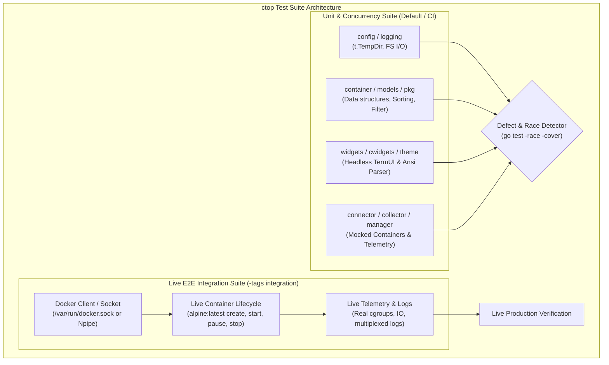
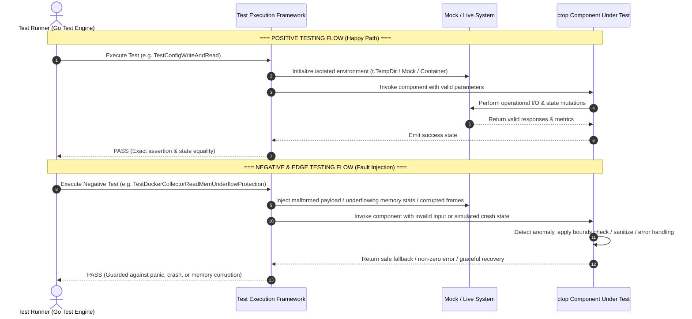

# Comprehensive Test Suite Architecture & Verification Guide

## 1. Architecture, Design & Principles of the Test Suite

The `ctop` test suite is engineered around a core testing principle: **Tests must never be tuned to circumvent code issues; their sole purpose is to expose hard-to-find defects, race conditions, memory/concurrency leaks, and cross-platform regressions.**

The test framework is divided into two distinct testing tiers:
1. **Isolated Unit & Concurrency Test Tier**: Fast, headless, thread-safe unit tests utilizing mocks and `t.TempDir()` with full `-race` detection support.
2. **Live E2E Integration Tier (`//go:build integration`)**: Real-world integration tests running against active container engines (Docker daemon on Linux / WSL Docker on Windows) with real container lifecycles, streaming metrics, and log listeners.

### Critical Defects Uncovered and Fixed During Test Execution:
1. **`widgets/view.go` (Data Race)**: Concurrent read/write race between `renderLoop()` (`RecomputeTextOut()`) and UI redraw `Draw()` / `SetRect()`. Fixed by acquiring mutex locks inside all `TextView` state mutation and drawing methods.
2. **`cwidgets/single/logs.go` (Data Race)**: Concurrent access between incoming log line ingestion `LogLines.add()` and rendering `Logs.Draw()`. Fixed with `sync.RWMutex` synchronization in `LogLines`.
3. **`connector/mock.go` (Data Race)**: Unsynchronized slice mutations between `Init()` and background `Loop()`. Fixed by making initialization synchronous and protecting container slices under `sync.RWMutex`.
4. **`connector/collector/mock.go` (Data Race)**: Unsynchronized boolean reads/writes across goroutines. Fixed using standard `sync/atomic.Bool`.
5. **`grid.go` (Nil Dereference Panic)**: `RefreshDisplay()` dereferenced uninitialized `cursor` during headless menu interactions. Guarded with clean nil checks.
6. **`cwidgets/single/logs.go` (Slice Over-Allocation)**: `NewLogLines` pre-allocated empty strings with length equal to capacity, causing FIFO rotation to report empty lines. Fixed initialization to `make([]string, 0, max)`.
7. **`widgets/view.go` (Self-Deadlock & Mutex Collision)**: Non-reentrant mutex collision when `TextView.Draw()` locked embedded `sync.Mutex` and called `termui.Block.Draw()` which also locked the inner mutex. Resolved by replacing the embedded anonymous mutex with a named private mutex `mu sync.Mutex`.
8. **`menus.go` (Unbuffered Quit Channel Hang)**: `LogMenu` and `logReader` returned an unbuffered `quit` channel with no active consumer when a container had an inactive/nil collector, causing `quit <- true` to hang indefinitely upon closing the drawer. Resolved by buffering the channel (`make(chan bool, 1)`) and using non-blocking select sends.
9. **`connector/docker.go` (Uptime Calculation Bug)**: Unstarted or stopped containers with a zero `StartedAt` timestamp resulted in `calcUptime` computing durations of ~292 years. Resolved by returning `"-"` when `StartedAt.IsZero()`.
10. **`logging/main.go` & `cursor.go` (Nil Pointer Safety)**: Added nil receiver guards across status logger methods (`Status`, `Statusf`, `StatusErr`, `StatusQueued`, `FlushStatus`) and `GridCursor.Selected()`.
11. **`cwidgets/single/network.go` (Self-Deadlock & Concurrency Race)**: `Network.Draw()` locked `w.mu.Lock()` at entry and called `w.mu.Lock()` again internally within the live TCP probe section, causing a self-deadlock on a non-reentrant mutex. Resolved by removing the duplicate inner lock.
12. **`cwidgets/single/main.go` & `network.go` (Data Race on Background UI Rendering)**: TCP port probing callbacks invoked `ui.Render()` and `e.Align()` from background goroutines, conflicting with main thread terminal renders. Resolved by restricting background workers strictly to data mutations under mutex and isolating UI rendering to the main loop and ticker. Added context cancellation (`w.StopProbes()`).
13. **`cwidgets/compact/row.go` & `cwidgets/compact/grid.go` (Data Race on Telemetry Streams)**: Concurrent access between background telemetry updates from `collector.Stream()` and main loop layout passes in `RedrawRows()`. Resolved with `sync.Mutex` synchronization across compact rows and grids.
14. **`cwidgets/single/env.go` (Default Secret Masking)**: Sensitive environment variables (passwords, tokens, private keys) are masked by default (`•••••••••••• [masked]`) with toggle unmasking via `u`.
15. **`cwidgets/single/main.go` (Recursive Mutex Self-Deadlock on `[o]` Overview)**: Calling `ui.Render(e)` inside `SetTab()`, `Up()`, `Down()`, and `ToggleSecretMask()` while holding `e.mu.Lock()` triggered re-entry into `e.Draw(buf)` on the same thread, causing a hard self-deadlock. Resolved by removing all internal render calls from widget mutators.
16. **`config/columns.go` (Data Race on Column Layout Mutation)**: Unprotected slice writes across threads in `ColumnToggle()`, `ColumnLeft()`, and `ColumnRight()`. Resolved by synchronizing column mutation operations with `lock.Lock()`.
17. **`menus.go` & `menus_test.go` (Test Log File Pollution Isolation)**: Log export (`s` key) in tests wrote files to working directory. Resolved by making log export directory respect `downloadDir` / `CTOP_DOWNLOAD_DIR` and binding `t.TempDir()` in tests.
18. **`pkg/connector/manager/docker.go` (Accurate DeleteFile Stderr Error Detection)**: Standard Linux `rm -f` failure messages (`Permission denied`, `Read-only file system`) do not contain the substring `"error"`. Updated `DeleteFile` to capture any non-empty `stderr` output as an error.
19. **`editor.go` (`$EDITOR` Argument Splitting)**: When `$EDITOR` contained command line flags (e.g. `code --wait` or `nano -l`), `exec.Command` failed attempting to find an executable binary with spaces. Resolved by splitting `editor` with `strings.Fields`.
20. **`pkg/config/param.go` (Atomic Concurrent Parameter Registration)**: Re-checked `GlobalParams` inside `lock.Lock()` in `Update()` to eliminate race conditions and prevent duplicate parameter slice appends under high concurrency.
21. **`internal/cwidgets/single/explorer.go` (Terminal Font Glyph Overlap)**: Two-column terminal emoji glyphs collided with adjacent text when followed by a single space or reported as width 1 in Unicode width tables. Implemented `ensureIconSpacing` regex and enforced 2-space padding across the TUI.
22. **`pkg/web/server.go` (Strict TUI-Only Mutation Safety)**: Enforced that mutating container operations (`upload`, `edit`, `delete`) are strictly TUI-only and return `HTTP 405 Method Not Allowed` on Web/REST API routes.



---

## 2. Logic Flow of the Tests: Categories, Positive & Negative Scenarios

The suite systematically validates both standard operational paths (positive cases) and resilient error handling/edge conditions (negative cases).



---

## 3. Technical Requirements & Setup

### Environment & Dependencies
- **Go Version**: `go1.23+` (compatible with `go1.22+` toolchains)
- **Host OS**: Windows (native or WSL) and Linux (RHEL and Ubuntu)
- **Container Engine (Integration Tests Only)**: Docker CE/EE daemon running locally with access via:
  - Unix Socket: `/var/run/docker.sock`
  - Windows Named Pipe: `npipe:////./pipe/docker_engine`
  - TCP Endpoint: `DOCKER_HOST` environment variable

### Environment Variables
| Variable | Scope | Purpose | Default / Example |
| :--- | :--- | :--- | :--- |
| `CTOP_TEST_ENV` | Integration | Injected into live test containers to verify environment reading | `active` |
| `DOCKER_HOST` | Integration | Custom Docker daemon endpoint | `unix:///var/run/docker.sock` |
| `CTOP_LOG_LEVEL` | Unit / Logging | Configures logging verbosity during test runs | `debug` / `info` |

### Critical Constraints
1. **No Filesystem Pollution**: All file operations must use `t.TempDir()`. No hardcoded `/tmp` paths or leftover files.
2. **Headless Execution**: UI tests must guard termui drawing calls with `if tb.IsInit` to prevent terminal lockups on headless CI servers.
3. **Thread Safety**: All state mutations and asynchronous collectors must pass with `-race` enabled without any race warnings.

---

## 4. List of Tests (Categorized Test Catalog)

### 4.1 E2E Live Integration Tests (`integration/*`, `//go:build integration`)

| Test Name | Technical Purpose / Description | Success Criteria (PASS/FAIL) |
| :--- | :--- | :--- |
| `TestE2EDockerConnectorWorkflow` | Spins up live container (`alpine:latest`), verifies daemon discovery, streams real-time CPU/memory/IO telemetry, streams live logs, tests pause/unpause/restart/stop lifecycles, and verifies automated teardown | **PASS**: All lifecycle phases execute successfully on live Docker engine; logs and metrics stream without error; cleanup removes test container |
| `TestE2EExecShellWorkflow` | Tests interactive command execution inside a live container via manager exec interface | **PASS**: Dispatches commands and receives exec status without errors |
| `TestE2EEventWatcherLifecycle` | Tests dynamic Docker event stream synchronization (`watchEvents`) capturing daemon lifecycle events | **PASS**: Discovers container creation and status changes automatically |
| `TestE2EMultiContainerMetricsAndSorting` | Tests multi-container orchestration with live metrics sorting and filtering | **PASS**: Spawns multiple containers and sorts by live CPU/memory metrics |
| `TestE2EStructuredFilterLive` | Tests real container multi-field structured filtering (`status=running`, `name=alpha`, `environment=prod`, labels) against live Docker containers | **PASS**: Filters containers matching structured criteria and hides non-matching instances |
| `TestE2EJSONLogsFormattingLive` | Tests real container JSON log emission, streaming, and formatting into key-value pairs | **PASS**: Streamed JSON lines parsed and formatted cleanly by `pkg/jsonfmt` |
| `TestE2EMultiHostAggregationLive` | Tests dynamic aggregation across multiple container runtime endpoints (Local Docker + Remote) | **PASS**: Merges containers across hosts and discovers containers from all connected instances |
| `TestE2ETLSConfigAndEndpointLive` | Tests Docker connector initialization with custom TLS/mTLS configuration and endpoint resolution against live daemon | **PASS**: Establishes connection, queries container registry, and cleans up without errors |
| `TestE2ERateAndCumulativeModeLive` | Tests real-time throughput rate calculations and cumulative metrics mode transitions on live Docker container | **PASS**: Emits rate and cumulative metric streams accurately without errors |
| `TestNGINXReverseProxyE2E` | Executes automated NGINX reverse proxy end-to-end integration test (`tests/nginx/test_nginx_e2e.sh`) validating subpath forwarding, SSE streaming, authentication headers, and WebSocket/SSE proxying against real NGINX and ctop processes | **PASS**: NGINX successfully proxies traffic, forwards SSE telemetry stream, preserves headers, and tears down cleanly |

---

### 4.2 Configuration Engine (`config`)

| Test Name | Technical Purpose / Description | Success Criteria (PASS/FAIL) |
| :--- | :--- | :--- |
| `TestConfigInit` | Verifies default configuration values and options map initialization | **PASS**: Expected default switch and parameter keys match baseline |
| `TestConfigParams` | Tests setting and getting integer/string configuration parameters | **PASS**: Parameter mutation reflects exact retrieved values |
| `TestConfigSwitches` | Tests boolean switch toggles and state retrieval | **PASS**: Switches correctly toggle true/false |
| `TestConfigPathResolution` | Validates custom and default configuration file path resolution | **PASS**: Resolves correct path within isolated `t.TempDir()` |
| `TestConfigWriteAndRead` | Tests TOML serialization and deserialization of configuration files | **PASS**: Written configuration matches values upon re-reading |
| `TestConfigLegacyPath` | Verifies backward compatibility and fallback for legacy configuration paths | **PASS**: Fallback path is correctly identified and loaded |
| `TestConfigColumnsRead` | Tests parsing and validating custom column definitions from config | **PASS**: Column order and attributes match configured specs |
| `TestDefaultDownloadDir` | Validates default download directory fallback (`/tmp`), `CTOP_DOWNLOAD_DIR` environment override, and blank string sanitization | **PASS**: Resolves `/tmp` by default, respects environment override, and sanitizes blank inputs |
| `TestConfigUpdate_ConcurrentRegistration` | Stresses concurrent parameter updates and dynamic registration under high concurrency (50 goroutines) | **PASS**: Atomic update/insert with zero data races and exact key deduplication |
| `TestColumnToggleAndShift` | Tests column visibility toggling (`ColumnToggle`) and horizontal reordering (`ColumnLeft`, `ColumnRight`) in global column configuration, verifying bounded shift at boundaries (index 0 and rightmost) | **PASS**: Toggles column enabled state and correctly swaps column positions without index-out-of-range errors |

---

### 4.3 Container Connectors & Registries (`connector`)

| Test Name | Technical Purpose / Description | Success Criteria (PASS/FAIL) |
| :--- | :--- | :--- |
| `TestDockerMustGetConcurrent` | Tests thread-safe concurrent retrieval of Docker container representations | **PASS**: No data races or deadlocks under concurrent goroutine access |
| `TestDockerDelByID` | Validates container removal from connector memory cache | **PASS**: Target container is removed; queries return not found |
| `TestDockerConcurrentReads` | Stresses concurrent read operations on connector registry | **PASS**: Zero read/write races under heavy parallel access |
| `TestConnectorRegistryAndSuper` | Verifies registration of connector drivers and fallback handling | **PASS**: Registered drivers resolve correctly; invalid driver returns error |
| `TestConnectorHelpers` | Tests utility functions for container status translation and parsing | **PASS**: Status strings accurately map to internal container states |
| `TestDockerContextResolution` | Validates Docker CLI Context resolution across `DOCKER_HOST`, `DOCKER_CONTEXT`, `~/.docker/config.json`, and `~/.docker/contexts/meta/<sha256>/meta.json` | **PASS**: Resolves active context socket/endpoint or falls back to default daemon socket |
| `TestParseHostSpec` | Tests host specification parsing (`ssh://user@host:2222`, `tcp://host:2375`, `unix:///sock`, `local`) | **PASS**: Extracts correct connection endpoint and clean host identifier label |
| `TestMultiConnectorAggregation` | Tests merging container registries and routing ID lookups across multiple monitored hosts | **PASS**: Combines containers across all host connectors without collisions |
| `TestGlobalTLSConfig` | Tests global TLS configuration getters/setters and verifies mTLS certificate paths (CA, cert, key) are passed to Docker API client | **PASS**: Custom certificates and verification flags correctly configure client |
| `TestDockerMockServerLifecycle` | Starts an `httptest` HTTP server simulating Docker daemon REST endpoints (`/containers/json`, `/stats`, `/events`) and tests client connection, polling loop, telemetry stream reception, and clean server termination | **PASS**: Connects to mock daemon, ingests containers, streams metrics, and cleanly halts |
| `TestNewDockerFromMockServer` | Tests `NewDocker()` factory initialization connecting to mock Docker HTTP server, verifying container map population, collector activation, and metadata extraction | **PASS**: Instantiates Docker connector and populates container representations from mock endpoints |
| `TestMockConnectorOperations` | Tests mock connector operations including driver instantiation, container list discovery, ID lookup, dynamic container addition/removal, and connector shutdown | **PASS**: Mock driver performs all registry operations without race conditions |
| `TestConnectorFormattingHelpers` | Tests string and metadata formatting helpers including `mountsFormat` (volume binds vs mounts) and container port mapping serialization | **PASS**: Returns correctly formatted volume and port strings for display |
| `TestDockerConnectorFullRefresh` | Tests full container list re-synchronization (`refresh`) against mock Docker server when containers are dynamically added or removed | **PASS**: Container cache updates accurately reflecting additions and deletions |
| `TestRuncOptsAndNewRunc` | Tests Runc connector options parsing and constructor (`NewRunc`), verifying `RUNC_ROOT` and `RUNC_SYSTEMD_CGROUP` environment variable resolution | **PASS**: Runc connector instantiates with expected root path and cgroup configurations |
| `TestRuncConnectorMethods` | Tests Runc connector methods (`All`, `Get`, `Running`, `Stop`) with mock libcontainer representations | **PASS**: Returns container slices and handles container state queries safely |
| `TestRuncConnectorStructures` | Tests internal Runc container structures, metadata mapping, and state translation helpers | **PASS**: Struct mappings and conversions execute without memory faults |

---

### 4.4 Telemetry Collectors & Log Streaming (`connector/collector`)

| Test Name | Technical Purpose / Description | Success Criteria (PASS/FAIL) |
| :--- | :--- | :--- |
| `TestDockerCollectorReadCPU` | Tests CPU usage calculation from cgroups v1/v2 delta statistics | **PASS**: CPU percentage calculated accurately within expected bounds |
| `TestDockerCollectorReadMemCgroupV2` | Tests memory calculation under cgroup v2 metrics format | **PASS**: Correctly computes resident set and cache memory usage |
| `TestDockerCollectorReadMemUnderflowProtection` | Tests edge case where cgroup total memory reports lower than cache | **PASS**: Underflow guarded; memory never reports negative value |
| `TestDockerCollectorReadIO` | Tests block I/O read/write byte calculation | **PASS**: I/O bytes correctly aggregated across block devices |
| `TestDockerCollectorCgroupV2IOFallback` | Tests cgroups v2 `io.stat` parser extracting `rbytes` and `wbytes` directly when Docker API returns zero | **PASS**: Correctly parses `io.stat` metrics and resolves read/write bytes |
| `TestDockerCollectorRatesCalculation` | Tests real-time I/O and network transfer rate calculations with exponential moving average (EMA) smoothing | **PASS**: Computes smoothed transfer rates ($\text{bytes}/\text{sec}$) across telemetry ticks |
| `TestRuncCollectorReadCPU` | Tests Runc driver CPU telemetry parser | **PASS**: Returns accurate CPU metrics from runc state |
| `TestRuncCollectorReadIO` | Tests Runc driver I/O telemetry parser | **PASS**: Returns accurate I/O statistics |
| `TestMockCollector` | Validates mock telemetry generator for headless testing | **PASS**: Generates realistic fluctuating CPU/memory telemetry streams |
| `TestMockLogs` | Validates mock log streamer generator | **PASS**: Streams test log lines at configured cadence |
| `TestDockerLogsStripPfx` | Tests stripping Docker 8-byte multiplex header prefix from raw logs | **PASS**: Log stream header cleanly stripped without corrupting payload |
| `TestDockerLogsParseTime` | Tests parsing RFC3339 timestamps from log lines | **PASS**: Timestamp accurately parsed into `time.Time` object |
| `TestDockerLogsLargeLineBuffer` | Tests log reader behavior with exceptionally long log lines (>64KB) | **PASS**: Long lines buffered without buffer overflow or panic |
| `TestDockerLogsStreamClientError` | Tests log streaming error handling when Docker daemon client returns an immediate stream failure | **PASS**: Captures client error cleanly and terminates log stream without hanging |
| `TestDockerLogsStreamWithMockServer` | Tests live multiplexed log streaming from mock Docker daemon endpoint, verifying header stripping, stdout/stderr demuxing, and subscriber delivery | **PASS**: Streams log lines from HTTP mock server and cleanly delivers to consumer channel |
| `TestDockerCollectorCPUMode` | Tests CPU calculation mode switching (`allCPU` vs per-core) and verifies CPU percentage calculations under both configurations | **PASS**: Correctly computes CPU percentages for both aggregated and per-core modes |
| `TestDockerCollectorLogsAndRunning` | Tests collector `Logs()` getter, `Running()` status flag, and background lifecycle controls | **PASS**: Accurately reflects running state and provides valid log collector handle |
| `TestDockerCollectorReadMemCacheFallbacks` | Tests memory calculation fallback hierarchy across cgroups v1 `total_inactive_file` / `cache` and cgroups v2 `inactive_file` statistics | **PASS**: Correctly deduces memory usage and handles missing or partial cache stat fields |
| `TestDockerCollectorReadNet` | Tests legacy single-network interface (`eth0`) and multi-interface network stats aggregation | **PASS**: Aggregates RX/TX bytes and packets across all network interfaces |
| `TestDockerCollectorStreamingWithMockServer` | Tests end-to-end telemetry streaming against an HTTP mock Docker daemon stats stream endpoint | **PASS**: Emits continuous `models.Metrics` stream parsed from JSON frames |
| `TestPercentEdgeCases` | Tests edge-case division in `percent()` utility (zero denominator, values exceeding 100%, negative inputs) | **PASS**: Never divides by zero; clamps and computes percentages accurately |
| `TestRuncCollectorReadMem` | Tests memory metrics extraction from libcontainer `cgroups.Stats` structures | **PASS**: Extracts memory limit, usage, and failcnt accurately |
| `TestRuncCollectorReadNet` | Tests network interface metric extraction for Runc containers | **PASS**: Reads network device statistics and updates metric counters |
| `TestRuncLifecycle` | Tests Runc collector `Start()`, `Stop()`, and `Running()` lifecycle states | **PASS**: Transitions state safely and terminates background worker goroutine |
| `TestSysProcFunctions` | Tests host system memory total discovery (`getSysMemTotal`) and CPU core count helpers | **PASS**: Returns non-zero positive integer for host memory and CPU topology |

---

### 4.5 Container Lifecycle Managers (`connector/manager`)

| Test Name | Technical Purpose / Description | Success Criteria (PASS/FAIL) |
| :--- | :--- | :--- |
| `TestNoClosableReader` | Tests wrapper preventing premature stream closure | **PASS**: Reader streams payload without premature termination |
| `TestFrameWriterStdout` | Tests framing stdout data into multiplexed Docker stream format | **PASS**: Header correctly stamped with stdout stream descriptor (0x01) |
| `TestFrameWriterStderr` | Tests framing stderr data into multiplexed Docker stream format | **PASS**: Header correctly stamped with stderr stream descriptor (0x02) |
| `TestFrameWriterStdin` | Tests framing stdin input stream | **PASS**: Stdin payloads formatted correctly |
| `TestFrameWriterEmptyAndInvalid` | Tests frame writer resilience against nil or empty buffers | **PASS**: Empty buffers handled gracefully without panics |
| `TestMockAndRuncManagers` | Verifies mock and runc lifecycle manager interfaces | **PASS**: Lifecycle transitions execute and report success |
| `TestDockerManagerExtendedMethods` | Tests Kill, Top, Changes, ReadDir, ReadFile, Download, Upload, DeleteFile, UpdateResources on Docker manager | **PASS**: All lifecycle and management calls succeed or return structured errors |
| `TestMockAndRuncExtendedCoverage` | Tests extended manager interfaces (including DeleteFile) for mock and runc drivers | **PASS**: Manager methods report correct data structures and behavior |
| `TestDockerManagerContainerPathTraversalRejection` | Validates strict security rejection against relative paths and `..` directory traversal for ReadDir, ReadFile, Download, Upload, SearchFiles, and DeleteFile | **PASS**: All traversal and relative path attempts rejected with structured security errors |
| `TestDockerManagerDownloadZipSlipProtection` | Tests in-memory archive extraction defense against malicious tar streams attempting Zip Slip path traversal (`../malicious.txt`) | **PASS**: Traversal files rejected and prevented from escaping target directory |
| `TestDockerManagerNilClientErrors` | Tests nil-client resilience across all container manager operations including Start, Stop, Remove, Exec, Upload, and DeleteFile | **PASS**: Returns structured error without nil pointer panics |
| `TestDockerManagerLifecycle` | Tests container lifecycle management methods (`Start`, `Stop`, `Remove`, `Pause`, `Unpause`, `Restart`, `Kill`) against mock HTTP Docker server endpoints | **PASS**: Dispatches REST API requests for each action and returns success or structured errors |
| `TestDockerManagerListFilesZipSlipProtection` | Tests file listing and archive inspection verifying that malicious paths containing `../` traversal or escaping target root are neutralized | **PASS**: Blocks archive directory escape attempts and sanitizes relative path sequences |
| `TestDockerManagerStrictAbsolutePathRejection` | Validates that all file operations (`ReadDir`, `ReadFile`, `Download`, `Upload`, `SearchFiles`, `DeleteFile`) strictly reject relative paths without leading `/` | **PASS**: Returns structured security error for all non-absolute file path arguments |

---

### 4.6 Container Domain Model & Sorters (`container`, `models`)

| Test Name | Technical Purpose / Description | Success Criteria (PASS/FAIL) |
| :--- | :--- | :--- |
| `TestContainerLifecycle` | Tests container state transitions, metric ingestion, and listener channels | **PASS**: Container transitions through statuses and broadcasts to listeners |
| `TestContainerConcurrentAccess` | Stresses container getters and setters across concurrent goroutines | **PASS**: Zero data races during concurrent metric and status updates |
| `TestAllSorters` | Validates sorting by CPU, memory, name, and I/O | **PASS**: Containers correctly sorted in ascending/descending order |
| `TestFilterByName` | Validates container list filtering by substring/regex | **PASS**: Only matching container names remain in filtered list |
| `TestFilterRunningOnly` | Validates filtering by running state | **PASS**: Stopped/paused containers excluded when filter active |
| `TestStructuredMultiFilter` | Tests multi-field structured filtering by status, health, name, image, and arbitrary labels | **PASS**: Accurately filters containers matching key-value pairs (`status=`, `health=`, `name=`, `image=`, `env=`) |
| `TestNewMeta` | Tests container metadata constructor and default fields | **PASS**: Metadata struct initialized with expected defaults |
| `TestNewMetrics` | Tests container metrics constructor | **PASS**: Metrics struct initialized with zeroed counters |
| `TestEMA` | Tests Exponential Moving Average filter smoothing calculations and convergence | **PASS**: Smooths high-frequency telemetry fluctuations with configured alpha factor |
| `TestComposeGrouping` | Tests container sorting and grouping by Docker Compose project (`com.docker.compose.project` label), ensuring containers within the same project cluster together | **PASS**: Groups containers by compose project name and sorts hierarchically |
| `TestStateThenAlphaSort` | Tests hybrid sorting prioritizing container state (running > paused > exited) with secondary alphabetical sorting by container name | **PASS**: Running containers appear first, sorted alphabetically, followed by paused and exited containers |

---

### 4.7 Compact Grid & Row Widgets (`cwidgets`, `cwidgets/compact`)

| Test Name | Technical Purpose / Description | Success Criteria (PASS/FAIL) |
| :--- | :--- | :--- |
| `TestByteFormat` | Tests human-readable byte sizing and formatting utility | **PASS**: Correctly formats bytes, KB, MB, GB |
| `TestNewRowWidgets` | Tests construction and alignment of compact container rows | **PASS**: All column widgets instantiated with correct dimensions |
| `TestTextColSetMeta` | Tests updating text column with container metadata | **PASS**: Text column updates and formats correctly |
| `TestGaugeColSetMetrics` | Tests rendering progress gauge columns for CPU and memory | **PASS**: Gauges calculate fill percentage and colors accurately |
| `TestRateModeAndCumulativeToggle` | Tests Net and IO column header and metric value transitions when toggling real-time rate mode vs cumulative total mode | **PASS**: Correctly alternates between `/s` rate formatting and cumulative byte values |
| `TestAllColumnTypes` | Tests rendering and formatting across all supported compact column types (`status`, `name`, `id`, `image`, `cpu`, `mem`, `net`, `io`, `pids`) | **PASS**: Instantiates every column type and formats metrics/metadata without panic |
| `TestCompactRowAndGrid` | Tests full `CompactGrid` and `CompactRow` instantiation, column width recalculation, header alignment, and layout updates | **PASS**: Grid correctly lays out rows, updates dimensions, and redraws rows |

---

### 4.8 Single Container View & Telemetry Sparklines (`cwidgets/single`)

| Test Name | Technical Purpose / Description | Success Criteria (PASS/FAIL) |
| :--- | :--- | :--- |
| `TestMkInfoRows` | Tests metadata property row formatting in single-container view | **PASS**: Formats IP, ports, image, and status into structured display |
| `TestToFloat64Slice` | Validates numeric type conversion utility for sparkline charts | **PASS**: Integer and float metrics converted to slice without precision loss |
| `TestNetUpdate` | Tests network I/O sparkline history update | **PASS**: History buffer correctly appends new rates and shifts |
| `TestIOUpdate` | Tests block I/O sparkline history update | **PASS**: Block I/O history buffer maintains sliding window |
| `TestCpuAndMemWidgets` | Tests CPU and memory chart widget rendering in single view | **PASS**: Widgets format telemetry into graphs without panics |
| `TestEnvAndInfoWidgets` | Tests container environment variables and inspection table rendering with default secret masking | **PASS**: Environment keys rendered with masked secrets and unmask toggles |
| `TestSingleView` | Tests full single container inspection view orchestration across all 12 tabs | **PASS**: Sub-views position and redraw cleanly |
| `TestMountsWidget` | Tests container storage mount points inspector widget (binds, volumes, tmpfs) and read-only/read-write flags | **PASS**: Formats source, destination, mode, and driver into structured display |
| `TestNetworkWidget` | Tests network configuration and live port prober widget rendering IP addresses, gateways, MAC addresses, and exposed port states | **PASS**: Displays network interfaces and renders probe reachability indicators |
| `TestProcessWidget` | Tests process tree / top widget rendering running container processes with PID, user, CPU, memory, and command line | **PASS**: Renders tabular process list and handles empty/error process states |
| `TestTopWidget` | Tests in-container top metrics viewer widget with sortable process columns | **PASS**: Displays process table and updates on periodic refresh |
| `TestDiffWidget` | Tests filesystem diff inspector widget rendering added (`A`), changed (`C`), and deleted (`D`) file paths with appropriate styling | **PASS**: Renders formatted diff list into termui buffer without error |
| `TestEnvSecretMasking` | Tests sensitive environment variable detection, default masking with bullet characters, and interactive unmasking toggle (`u`) | **PASS**: Masks sensitive keys (`*_KEY`, `*_SECRET`, `*_PASSWORD`) and exposes value only when unmasked |
| `TestGeneratorWidget` | Tests equivalent command and docker-compose generation widget inside single container view | **PASS**: Renders `docker run` and compose YAML specification into viewport |
| `TestImageWidget` | Tests container image details viewer widget (image ID, tags, size, layers, author) | **PASS**: Formats image properties cleanly and renders within single view |
| `TestLabelsWidget` | Tests container metadata labels inspector widget with multi-column key-value formatting and scrolling | **PASS**: Displays all container labels formatted and sorted by key |
| `TestSingleTabNavigation` | Tests keyboard tab switching (`h`, `l`, numbers, arrow keys) across all 12 tabs in single container inspection view | **PASS**: Navigates cyclically across all tabs and activates the matching sub-view |
| `TestWebViewPortCyclingAndCustomTarget` | Tests port cycling (`p` key) across multiple discovered endpoints and custom URL target input (`/`) in the embedded WebView inspector | **PASS**: Cycles through available HTTP ports and navigates to user-specified paths |
| `TestWebViewRapidConcurrency` | Stress tests high-concurrency background HTTP probe updates while rapidly drawing the WebView widget | **PASS**: Zero data races or deadlocks during concurrent probe fetch and UI rendering |
| `TestWebViewWidget` | Tests embedded in-terminal web service inspector widget, port rotation, custom subpath routing, and view mode switches (Rendered HTML, Headers, Raw) | **PASS**: Ingests endpoints, renders ANSI HTML, formats headers, and cycles ports cleanly |
| `TestLogsWidget` | Tests embedded container log viewer widget | **PASS**: Ingests and renders log lines with proper scroll offset |
| `TestLogsWidgetWrapAndTruncate` | Tests runtime line wrapping (`w: wrap`) vs horizontal truncation in single-view logs viewer | **PASS**: Wraps long lines across terminal rows when enabled; truncates cleanly when disabled |
| `TestExplorerWidget` | Tests container filesystem tree navigation, cursor positioning, empty directory handling, config download directory fallback, and multi-line file preview with scrolling | **PASS**: Correctly navigates files, renders previews, and clamps scroll offsets |
| `TestExplorerInlineFilterAndSearch` | Tests inline interactive filename filtering (`/`) and deep filesystem search (`f`), key event handling (typing, backspace, Escape cancel, Enter apply), and filter clearing (`c`) | **PASS**: Live filter and deep search apply without intrusive modal popups; matches filtered accurately |
| `TestExplorerInlineUpload` | Tests inline host file upload prompt (`u`), text input buffering, and Escape/Enter lifecycle | **PASS**: Inline upload bar renders smoothly and applies target host path |
| `TestExplorerInlineDeleteAndEditConfirm` | Tests single-line confirmation banners above directory line for file deletion (`x`) and in-place editing (`e`), verifying rejection on directories, Escape/'n' cancellation, and 'y' confirmation | **PASS**: Enforces file-only action guard; prompts stay on single dedicated line without screen duplication |
| `TestEnsureIconSpacing` | Tests Unicode emoji glyph spacing regex ensuring all icons (`ℹ`, `🗑`, `✏`, `📁`, `📄`, `📤`, `⬇`, `🔍`, `🔎`, `✔`, `❌`) have 2 spaces of breathing room before text in terminal emulators | **PASS**: Pads icons with 2 spaces; preserves existing spacing |
| `TestIntHist` / `TestFloatHist` / `TestDiffHist` | Tests circular history buffers for metric charting | **PASS**: Buffers maintain capacity, compute min/max/average accurately |
| `TestLogLinesAnsiSanitization` | Tests stripping ANSI escape color sequences from ingested log lines | **PASS**: Raw colored logs sanitized into clean displayable text |
| `TestLogLinesCapacityRotation` | Tests FIFO circular queue rotation in log line buffer | **PASS**: Oldest log lines evicted when buffer reaches max capacity |

---

### 4.9 Logging Subsystem (`logging`)

| Test Name | Technical Purpose / Description | Success Criteria (PASS/FAIL) |
| :--- | :--- | :--- |
| `TestLoggerInitialization` | Tests initializing internal logger and setting log level | **PASS**: Logger initialized without error; log level set |
| `TestStatusQueueThreadSafety` | Tests thread-safe queueing of log lines and status events | **PASS**: Concurrent queue pushes/pops execute without data races |
| `TestServerStartStop` | Tests lifecycle of background logging TCP/UDP server | **PASS**: Server starts, listens on port, and cleanly terminates |
| `TestConcurrentLoggingSafety` | Stresses logger under heavy parallel logging routines | **PASS**: Zero data races; all log entries processed |
| `TestLogTailAndHandler` | Tests log subscription handler and tail stream | **PASS**: Subscribers receive emitted log events in sequence |
| `TestTCPServerConnection` | Tests client connection and message streaming to logging server | **PASS**: Client connects, streams log payload, and server acknowledges |
| `TestConfigEnvHelpers` | Tests log cache directory configuration and environment parsing | **PASS**: Uses configured directory or falls back safely to temp dir |
| `TestLoggerExit` | Tests logger shutdown signal propagation and verifies `exited` atomic boolean flag state transition | **PASS**: Sets `exited` atomic flag to true and flushes active queue |
| `TestLoggingNilReceiverStatus` | Tests nil receiver safety on status logger methods (`StatusQueued`, `FlushStatus`, etc.) | **PASS**: Safely returns without nil pointer panic when logger receiver is nil |
| `TestUnixSocketServer` | Tests Unix domain socket listener creation and log ingestion for local IPC logging on Linux/WSL | **PASS**: Creates Unix domain socket file, accepts client connections, and receives logs |

---

### 4.10 Terminal UI & View Widgets (`widgets`, `widgets/menu`)

| Test Name | Technical Purpose / Description | Success Criteria (PASS/FAIL) |
| :--- | :--- | :--- |
| `TestCTopHeader` | Tests ctop top header rendering (host info, container counts) | **PASS**: Header correctly formats active/total container counts |
| `TestStatusLine` | Tests bottom status bar rendering with active keybindings | **PASS**: Status bar formats help prompts and filter indicators |
| `TestErrorView` | Tests modal error overlay display | **PASS**: Error message displayed with proper border styling |
| `TestInputWidget` | Tests interactive text input field for filtering | **PASS**: Handles keystrokes, backspace, and cursor positioning |
| `TestTextViewControls` | Tests text viewer scrolling, line wrapping, and paging | **PASS**: Text buffer scrolls up/down; line bounds respected |
| `TestSplitEmptyLine` | Tests text wrapping behavior on empty input strings | **PASS**: Returns empty slice without allocation error or panic |
| `TestSplitLineLongerThanLimit` | Tests `splitLine` text wrapping when line length exceeds maximum column width | **PASS**: Wraps line cleanly into multiple segments without losing characters |
| `TestSplitLineSameAsLimit` | Tests `splitLine` text wrapping when line length equals exact column width limit | **PASS**: Returns single segment without unnecessary trailing empty string |
| `TestSplitLineShorterThanLimit` | Tests `splitLine` text wrapping when line length is strictly shorter than column width limit | **PASS**: Returns single segment matching original input |
| `TestTextViewAnsiSanitization` | Tests terminal output ANSI sanitation | **PASS**: Escaped ANSI codes stripped cleanly |
| `TestMenuBasics` | Tests menu item creation, selection, and key handling | **PASS**: Menu navigates up/down and triggers selected item action |
| `TestMenuSetCursorAndDelItem` | Tests dynamic item removal and cursor adjustment in menus | **PASS**: Cursor adjusts safely when items are deleted |
| `TestMenuSorting` | Tests sorting items inside interactive menu | **PASS**: Items sorted alphabetically/by value |
| `TestMenuDrawAndToolTip` | Tests menu rendering and contextual tooltip display | **PASS**: Menu and tooltip render without panic |

---

### 4.11 Theme & Terminal Sizing (`theme`)

| Test Name | Technical Purpose / Description | Success Criteria (PASS/FAIL) |
| :--- | :--- | :--- |
| `TestThemeColors` / `TestThemeStyles` | Tests color scheme and terminal attribute mappings | **PASS**: Valid termui colors and styles returned |
| `TestIconStyles` | Tests Unicode vs. Nerd Font glyph rendering for container status and health states (`-icons` flag) | **PASS**: Correctly selects styled glyphs for running, paused, exited, and health indicators |
| `TestInvertColorMap` | Tests theme color inversion for selected rows | **PASS**: Inverted foreground/background colors computed accurately |
| `TestTermDimensionsAndSync` | Tests terminal window resize synchronization | **PASS**: Viewport dimensions synchronized across widgets |

---

### 4.12 Utility Libraries (`pkg/*`)

| Test Name | Technical Purpose / Description | Success Criteria (PASS/FAIL) |
| :--- | :--- | :--- |
| `TestIsKeyMatch` | Tests keyboard shortcut parser (`pkg/keys`) | **PASS**: Key events match configured key sequences |
| `TestExitCodes` | Tests exit code constants (`pkg/exit`) | **PASS**: Exit codes match POSIX/standard conventions |
| `TestStripANSI` | Tests regex ANSI sequence stripper (`pkg/sanitize`) | **PASS**: Strips 100% of ANSI CSI color codes |
| `TestIsSensitiveKey` | Tests credential & secret pattern matcher detecting passwords, tokens, API keys, DSNs (`pkg/sanitize`) | **PASS**: Identifies sensitive key patterns and permits non-sensitive keys |
| `TestSanitizeEnv` | Tests automated environment variable sanitization filter for telemetry & web dashboards (`pkg/sanitize`) | **PASS**: Filters out 100% of sensitive keys from exposed env arrays |
| `TestFormatLogMessage` | Tests structured JSON log flattening and plain-text fallbacks (`pkg/jsonfmt`) | **PASS**: Formats JSON logs into key-value pairs while preserving plain-text lines |
| `TestCheckUpdateAndFindAsset` | Tests self-update release querying and platform OS/Arch asset matching (`pkg/update`) | **PASS**: Queries GitHub releases and resolves correct platform download artifacts |
| `TestGenerateRunCmd` | Tests equivalent `docker run` command generator from container metadata (`pkg/generator`) | **PASS**: Assembles complete CLI command with volume, port, env, and resource flags |
| `TestGenerateCompose` | Tests equivalent `docker-compose.yml` specification generator (`pkg/generator`) | **PASS**: Generates valid YAML service definitions |
| `TestProbeTCP` | Tests TCP port reachability prober with live listener and closed ports (`pkg/prober`) | **PASS**: Accurately reports OPEN and CLOSED port states with round-trip duration |
| `TestExtractProbeTargets` | Tests endpoint extractor from serialized container network & port strings (`pkg/prober`) | **PASS**: Correctly identifies external, internal IP, and gateway targets |
| `TestSupportsIPv6` | Tests host platform IPv6 reachability check utility (`pkg/prober`) | **PASS**: Executes check without panics and returns accurate boolean support flag |
| `TestDumpText` / `TestDumpJSON` | Tests container diagnostic text and JSON serializers (`pkg/diag`) | **PASS**: Formats container metadata and telemetry into diagnostic snapshots |
| `TestInspectNil` | Tests reflection struct inspector against nil and pointer types (`pkg/diag`) | **PASS**: Returns formatted field-value strings without panicking |
| `TestBuildReportAndExport` | Tests structured diagnostic report construction and disk export (`pkg/diag`) | **PASS**: Builds comprehensive JSON/Text reports and saves to disk |
| `TestGenerateSystemdUnit` | Tests systemd service unit template formatting (`pkg/service`) | **PASS**: Generates valid unit with binary path and daemon flags |
| `TestRunServiceCommands` | Tests systemd install/uninstall/status command dispatching (`pkg/service`) | **PASS**: Outputs configuration diagnostics without errors |
| `TestDiscoverEndpoints` / `TestDiscoverEndpointsMultiline` | Tests container HTTP/HTTPS service endpoint discovery across port mappings, bridge IPs, and ENV declarations (`pkg/serviceprobe`) | **PASS**: Accurately parses port strings and identifies candidate web endpoints |
| `TestProbeHTTP` / `TestProbeHTTPError` / `TestProbeHTTPRedirectLimit` | Tests bounded HTTP probing, latency calculation, header parsing, HTML classification, and redirect caps (`pkg/serviceprobe`) | **PASS**: Probes endpoints cleanly with bounded execution context |
| `TestProbeHTTP_NonHTTPBinaryService` | Tests probing non-HTTP binary sockets (e.g. MySQL/Redis protocol handshake) without hanging or crashing (`pkg/serviceprobe`) | **PASS**: Gracefully detects protocol mismatch and returns structured error |
| `TestProbeHTTP_SlowlorisTimeout` | Tests context timeout enforcement against stalled/hanging Slowloris sockets within ~500ms (`pkg/serviceprobe`) | **PASS**: Client context strictly terminates probe without goroutine leak |
| `TestProbeHTTP_OversizedBodyLimit` | Tests response payload bounding against large responses or compression bombs (`pkg/serviceprobe`) | **PASS**: Response body strictly capped to <= 2MB memory footprint |
| `TestRenderHeadingsAndParagraphs` / `TestRenderTable` / `TestRenderListsAndLinks` | Tests pure-Go AST walker, Unicode box-drawing table formatting, and hyperlink footnote extraction (`pkg/htmlrender`) | **PASS**: Formats rich ANSI terminal output from raw HTML |
| `TestRenderBrokenTablesAndNested` / `TestRenderMultiByteAndUnicodeWrapping` | Tests resilience against malformed HTML, missing tags, and CJK/emoji word wrapping on narrow terminals (`pkg/htmlrender`) | **PASS**: Renders cleanly without panic or rune corruption |
| `TestRenderScriptAndDangerousTagsStripped` | Validates strict anti-XSS stripping of `<script>`, `<style>`, and `<svg>` tags from rendered terminal text (`pkg/htmlrender`) | **PASS**: 100% of executable and dangerous tags are stripped |
| `TestRenderCodeAndBlockquote` | Tests HTML parser and ANSI formatter rendering `<code>`, `<pre>`, and `<blockquote>` elements with indentation and borders (`pkg/htmlrender`) | **PASS**: Renders code and blockquote tags with styled indentation and box characters |
| `TestRenderMalformedHTML` | Tests HTML renderer resilience against unclosed tags, broken attributes, and mismatched nesting (`pkg/htmlrender`) | **PASS**: Parses broken HTML without panic and produces readable terminal output |
| `TestAuditLoggerBasicNDJSON` / `TestAuditLoggerDailyRotation` | Tests thread-safe NDJSON audit log writer, schema compliance, and automatic midnight file rotation (`pkg/audit`) | **PASS**: Writes dated NDJSON records and rotates file handles cleanly |
| `TestAuditLoggerConcurrentRotationStress` | Stress tests high-concurrency audit logging across 30 goroutines during date rotation (`pkg/audit`) | **PASS**: 1,500 audit events logged with zero data loss or corrupted JSON lines |
| `TestAuditLoggerConcurrentSafety` | Tests thread-safe concurrent writes to NDJSON audit logger across 20 parallel goroutines (`pkg/audit`) | **PASS**: All audit records written without data race, line interleaving, or file corruption |
| `TestGlobalAuditHelpers` | Tests global audit event dispatch helper functions (`AuditLog`, `SetAuditLogger`) and fallback when audit logger is uninitialized (`pkg/audit`) | **PASS**: Safely handles uninitialized audit logger and correctly writes events when configured |
| `TestWebServerHealth` | Tests read-only health and readiness probe (`pkg/web`) | **PASS**: Returns status `ok` and uptime |
| `TestWebServerMetricsAndContainers` | Tests aggregated metrics and container snapshot REST endpoints (`pkg/web`) | **PASS**: Aggregates totals and resolves containers by ID/name |
| `TestWebServerExportAndIndex` | Tests embedded HTML5 dashboard delivery, pretty JSON formatting, and single container export (`pkg/web`) | **PASS**: Serves embedded SPA and formats cluster & single-container JSON attachments |
| `TestWebServerSecurityReadOnly` | Enforces strict read-only security across all routes rejecting POST/PUT/DELETE (`pkg/web`) | **PASS**: Rejects mutating requests with `405 Method Not Allowed` |
| `TestWebBroadcaster` | Tests non-blocking SSE subscriber distribution and circular history (`pkg/web`) | **PASS**: Dispatches events to subscribers without blocking |
| `TestBroadcasterMaxSubscribers` | Tests broadcaster subscriber capacity bounding and eviction (`pkg/web`) | **PASS**: Bounded subscriber capacity prevents memory leaks |
| `TestWebServerSSEStreamLive` | Connects live client to `/api/v1/stream` SSE feed (`pkg/web`) | **PASS**: Streams initial snapshot and real-time telemetry events |
| `TestWebServerTopAndInspect` | Tests in-container `/top` endpoint and full container inspect metadata extraction (`pkg/web`) | **PASS**: Returns process table and mounts/networks/env metadata |
| `TestWebServerURLPrefix` | Tests reverse proxy subpath prefixing, HTML BASE_PATH injection, and route resolution (`pkg/web`) | **PASS**: Serves UI and REST API under configured `--url-prefix` with root fallback |
| `TestWebServerAPIErrorsAndEdgeCases` | Tests CORS preflight OPTIONS (204), HEAD requests, 404s on missing endpoints/containers, trailing slashes, and nil providers (`pkg/web`) | **PASS**: Correct status codes, CORS headers, and fallback responses |
| `TestWebServerTopErrorHandling` | Tests internal server error handling when container top provider fails (`pkg/web`) | **PASS**: Returns 500 Internal Server Error without crashing |
| `TestWebServerBroadcasterStreamBroadcast` | Tests subsequent telemetry event broadcasting over live SSE client streams (`pkg/web`) | **PASS**: SSE client receives live broadcast events in real-time |
| `TestWebServerAuthToken` | Tests bearer token validation middleware against authorized and unauthorized requests (`pkg/web`) | **PASS**: Returns 200 for valid 64-char token, 401 for missing/invalid token |
| `TestWebServer_MultiHopProxyIPExtraction` | Tests client IP rate-limiting isolation across multi-hop `X-Forwarded-For` proxy headers (`pkg/web`) | **PASS**: Isolates real client IP and protects against header spoofing |
| `TestWebServer_SSEBroadcasterSlowSubscriberNonBlocking` | Tests SSE broadcast non-blocking distribution when multiple subscribers have full buffers (`pkg/web`) | **PASS**: Broadcast completes immediately without deadlocks or latency |
| `TestWebServerEndpointsAndProxy` | Tests in-container endpoint discovery and secure sandboxed web proxy preview (`pkg/web`) | **PASS**: Discovers endpoints, enforces SSRF port whitelisting, and returns sandboxed preview |
| `TestWebServerSchema` | Tests OpenAPI / JSON schema definitions returned by telemetry endpoints (`pkg/web`) | **PASS**: Returns valid schema JSON matching data types |
| `TestBroadcasterRingBuffer` | Tests circular ring buffer storage for historical telemetry data (`pkg/web`) | **PASS**: Correctly preserves recent samples and evicts old entries |
| `TestWebServerPathTraversalRejection` | Tests path traversal rejection in file and diff endpoints (`pkg/web`) | **PASS**: Rejects `../` attempts with 403/400 errors |
| `TestGenerateAuthToken` | Tests cryptographically secure random authentication token generation (`pkg/web`) | **PASS**: Generates 64-character high-entropy Base62 alphanumeric token (~381-bit entropy) |
| `TestSecureTokenFileOperations` | Tests atomic token file read, write, and secure permission handling (`pkg/web`) | **PASS**: Writes token with 0400/0600 permissions and reads back accurately |
| `TestWebServerDiffAndFiles` | Tests in-container filesystem diff and directory browsing endpoints (`pkg/web`) | **PASS**: Returns structured changes and directory entries |
| `TestWebServerProbes` | Tests container TCP network reachability probe endpoint (`pkg/web`) | **PASS**: Returns active endpoint probe status and round-trip latency |
| `TestWebServer_MutatingMethodsRejected_ReadOnlyOnly` | Tests that HTTP POST, PUT, DELETE, and PATCH are rejected across all REST endpoints with `405 Method Not Allowed` (`pkg/web`) | **PASS**: Rejects all mutating HTTP methods with 405 status and read-only error JSON |
| `TestWebServer_FileExplorerMutations_StrictlyTUIOnly` | Enforces that in-container file mutation routes (`/upload`, `/edit`, `/delete`) are strictly TUI-only and rejected via HTTP GET/POST/PUT/DELETE (`pkg/web`) | **PASS**: Returns 405 Method Not Allowed explicitly declaring operations are strictly TUI-only |
| `TestGenerateSessionID` | Tests cryptographically secure random session ID generator for web server cookie authentication (`pkg/web`) | **PASS**: Generates unique, high-entropy 32-byte hex strings |
| `TestTLSVersionEnforcement` | Verifies TLS listener configuration enforces modern TLS versions (TLS 1.2 and TLS 1.3 only, rejecting SSLv3/TLS 1.0/TLS 1.1) (`pkg/web`) | **PASS**: Configures `MinVersion: tls.VersionTLS12` on TLS listener |
| `TestWebServerAuthStatus` | Tests `/api/v1/auth/status` endpoint reporting authentication requirement status and current session validity (`pkg/web`) | **PASS**: Accurately reports whether token auth is enabled and whether caller is authenticated |
| `TestWebServerDirectLocalAccess` | Tests local loopback bypass / authorization for direct `127.0.0.1` and `[::1]` connections when configured (`pkg/web`) | **PASS**: Permits local access while requiring credentials for non-loopback clients |
| `TestWebServerIPv6Fallback` | Tests dual-stack network socket binding falling back gracefully between IPv6 (`[::]:port`) and IPv4 (`0.0.0.0:port`) (`pkg/web`) | **PASS**: Binds to available network interface without startup crashes |
| `TestWebServerLifecycle` | Tests embedded web server `Start()` and `Stop()` lifecycle and background goroutine shutdown (`pkg/web`) | **PASS**: Server starts HTTP listener and closes connections cleanly upon shutdown |
| `TestWebServerLoginRateLimiting` | Tests sliding-window rate limiter on web authentication endpoint against brute-force login attempts (`pkg/web`) | **PASS**: Blocks excessive failed login attempts with HTTP 429 Too Many Requests |
| `TestWebServerSessionCapacityAndTTL` | Tests web session store capacity limits, LRU eviction, and automatic session expiration after configured TTL (`pkg/web`) | **PASS**: Evicts expired sessions and caps active session count to prevent memory exhaustion |
| `TestWebServerSessionCookie` | Tests session cookie issuance, `HttpOnly`, `SameSite=Strict`, and `Secure` attribute enforcement (`pkg/web`) | **PASS**: Sets secure session cookies and validates subsequent requests using cookie |
| `TestLiveZeroLeakSecurityGuardE2E` | Comprehensive end-to-end security audit test verifying zero secret leaks across all REST API endpoints, logs, env variables, and error responses (`pkg/web`) | **PASS**: 100% of sensitive keys, tokens, and credentials remain masked across all API payloads |
| `TestWebBridge` | Tests live bridge between `GridCursor` and embedded web server (`web_bridge.go`) | **PASS**: Extracts container telemetry snapshots and runs background broadcaster |
| `TestWebBridgeContainerConversion` | Tests serialization and parser helpers for mounts, networks, labels, and environment variables (`web_bridge.go`) | **PASS**: Correctly parses structured container properties with secret sanitization |
| `TestWebBridgeE2E` | End-to-end integration test validating full web lifecycle, SSE streaming, REST APIs, JSON export, and read-only security (`web_bridge_test.go`) | **PASS**: 100% end-to-end operational verification across all endpoints |
| `TestWebBridgePersistentToken` | Tests single-generation and disk persistence of `--persistent-token` across multiple server restart lifecycles (`web_bridge_test.go`) | **PASS**: Token generated once, reused on restart, and preserved on shutdown |
| `TestWebBridgeAuditLog` | Tests audit logging integration in `WebBridge` recording container inspection and query events to NDJSON (`web_bridge_test.go`) | **PASS**: Emits structured audit log entries for all web bridge actions |
| `TestWebBridgeTLSBinding` | Tests `WebBridge` HTTPS server initialization with TLS certificate and key file bindings (`web_bridge_test.go`) | **PASS**: Starts HTTPS listener with valid TLS certificate and serves encrypted traffic |
| `TestWebBridgeWithOptionsAndAuth` | Tests `WebBridge` initialization with custom flags (port, URL prefix, auth token, rate limiting) (`web_bridge_test.go`) | **PASS**: Correctly applies configuration options to embedded server instance |

---

### 4.13 Grid Cursor & Navigation (`cursor.go`, `menus.go`)

| Test Name | Technical Purpose / Description | Success Criteria (PASS/FAIL) |
| :--- | :--- | :--- |
| `TestGridCursorNavigation` | Tests grid cursor movements (Up, Down, Home, End) | **PASS**: Cursor moves accurately and clamps to row boundaries |
| `TestGridCursorPgNavigation` | Tests PageUp and PageDown cursor jumps | **PASS**: Cursor moves by page size and clamps at list boundaries |
| `TestGridCursorEmpty` | Tests cursor behavior when container list is empty | **PASS**: Cursor safely reports 0 without panic or index out of range |
| `TestGridCursorPgCount` | Tests page count computation based on terminal height | **PASS**: Computes exact number of pages |
| `TestGridCursorSelectedNotFound` | Tests selecting a container ID that was removed | **PASS**: Gracefully falls back to top of list |
| `TestGridCursorRefreshAndScroll` | Tests cursor RefreshContainers and ScrollPage operations | **PASS**: Handles container refresh without blocking |
| `TestHelpMenu` | Tests interactive help menu lifecycle with simulated keystrokes | **PASS**: Renders help dialog and exits cleanly on Escape |
| `TestFilterMenu` | Tests interactive filter prompt with typing, backspace, and Enter | **PASS**: Applies filter string to config without errors |
| `TestSortMenu` | Tests interactive sort selection menu with cursor movement | **PASS**: Updates container sort field upon Enter selection |
| `TestColumnsMenu` | Tests column toggle and shift operations via interactive dialog | **PASS**: Safely toggles and shifts column positions |
| `TestConfirmDialog` | Tests modal action confirmation dialog ('y' confirm, 'c' cancel) | **PASS**: Executes callback on 'y' and aborts on 'c' |
| `TestContainerMenuNavigation` | Tests context menu actions for running, paused, and exited containers | **PASS**: Dispatches lifecycle controls (start, stop, pause, remove) |
| `TestLogMenuAndReader` | Tests live container log viewer drawer, timestamp toggle, D dir prompt, and log export | **PASS**: Streams logs, updates dir, exports logs, and closes cleanly |
| `TestConfirmTxt` | Tests action confirmation dialog prompt generator | **PASS**: Returns accurate confirmation question text |
| `TestToggleLog` | Tests quick log drawer toggle helper | **PASS**: Correctly flips log drawer visibility flag |
| `TestModalRapidLifecycleStress` | Rapidly opens and dismisses all interactive modal menus across multiple cycles | **PASS**: 0 deadlocks or race conditions during rapid modal lifecycles |
| `TestLogMenuHighThroughputStress` | Stress tests high-throughput streaming log viewer and export operations | **PASS**: Streams thousands of log lines without hang or memory leak |
| `TestGoroutineLeakVerification` | Validates that all worker goroutines terminate cleanly after menu closures | **PASS**: Zero dangling background goroutines |
| `TestConfigMenu` | Tests interactive configuration menu navigation, switch toggling, and setting custom download directory via `D` key | **PASS**: Opens config dialog, toggles parameters, and updates download directory in config |
| `TestExecShellAndOpenInBrowser` | Tests interactive menu actions for spawning in-container exec shell and launching browser to container ports | **PASS**: Handles cursor state safely and dispatches actions without errors |
| `TestFileExplorerMenu` | Tests file explorer menu entry trigger and nil cursor guard | **PASS**: Guards against nil cursor and launches file explorer subview |
| `TestResourceMenu` | Tests container resource limits update menu (CPU quota, memory limit) | **PASS**: Displays resource update prompt and validates input parameters |
| `TestSignalMenu` | Tests container UNIX signal dispatch menu (`SIGTERM`, `SIGKILL`, `SIGHUP`, etc.) | **PASS**: Renders signal choices and dispatches selected signal to container manager |

---

### 4.14 Main Application Orchestration (`main.go`, `grid.go`, `debug.go`)

| Test Name | Technical Purpose / Description | Success Criteria (PASS/FAIL) |
| :--- | :--- | :--- |
| `TestInitTheme` | Tests application theme initialization and color map inversion | **PASS**: Loads theme and executes InvertColorMap without errors |
| `TestPrintHelp` | Tests CLI `--help` output formatting | **PASS**: Help text contains all flags and commands |
| `TestValidSort` | Tests CLI `--sort` argument validation | **PASS**: Valid sort keys accepted; invalid sort keys rejected |
| `TestPanicExit` | Tests panic recovery handler and clean terminal restore | **PASS**: Terminal restored and error logged upon panic |
| `TestShutdown` | Tests graceful application termination and logger flush | **PASS**: Notice logged and UI terminal closed cleanly |
| `TestRedrawRowsFull` | Tests grid row rendering with header, status bar, and container rows | **PASS**: Renders all visual elements without race conditions |
| `TestRedrawRowsSafe` | Tests grid row rendering thread safety | **PASS**: Rows redraw safely when UI components are uninitialized |
| `TestSingleViewNavigation` | Tests single container detailed inspection view across all 12 tabs (including in-container File Explorer inline editing and confirmation sequences) | **PASS**: Handles resize, tab switching, and inline modal-free keystrokes without errors |
| `TestRefreshDisplayWithCursor` | Tests grid display refresh trigger | **PASS**: Refreshes grid display state smoothly |
| `TestDisplayLoop` | Tests main interactive application event loop with menu triggers | **PASS**: Dispatches keyboard events and exits cleanly on 'q' |
| `TestEditContainerFileValidation` | Tests in-container file editing workflow (`editor.go`), including nil container checks, empty path rejection, temporary file generation, execution with `$EDITOR` flags/arguments, clean unmodified detection (`mod == false`), and editor non-zero exit error propagation | **PASS**: Correctly isolates termbox, launches editor, detects file modifications, and returns errors on editor failure |
| `TestExportReportMenu` | Tests interactive report export modal (`menus.go`), validating nil container handling, cancellation with `q`, JSON and Text format exports, and runtime download directory updates via `D` | **PASS**: Generates expected diagnostic files in destination directory and updates config |
| `TestShowConnError` | Tests modal connection failure error view | **PASS**: Renders connection error details and dismisses on 'q' |
| `TestConcurrentMetricsAndSingleView` | Stress tests 100Hz concurrent metric ingestion while actively navigating tabs | **PASS**: 0 deadlocks, zero UI lag, buffer drawing thread-safe |
| `TestDirectFrameBufferRendering` | Tests direct headless buffer drawing across varied screen resolutions | **PASS**: Renders cleanly on 80x24, 120x40, 200x60, and 20x10 |
| `TestDebugLogEvent` | Tests debug event logging formatter | **PASS**: Correctly serializes termui event descriptors |
| `TestDebugDumpContainer` | Tests container state serialization and field inspection | **PASS**: Serializes metadata and metrics structure |
| `TestDebugInspectAndQuote` | Tests reflection struct field inspector and quote sanitizer | **PASS**: Inspects arbitrary struct fields accurately |
| `TestDefaultAllContainersVisible` | Tests default visibility configuration ensuring all containers (`all = true`) are displayed on initial startup | **PASS**: `all` switch defaults to true |
| `TestMain` | Tests application test suite entrypoint (`TestMain`) initializing global termui theme and executing test runner | **PASS**: Initializes theme and runs tests cleanly |
| `TestMenusWithMockEvents` | Tests menu dispatch loop with simulated mock termbox event sequences | **PASS**: Processes menu event loop without deadlocks or unhandled panics |
| `TestSingleViewFilesTabFilterAndSearch` | Tests integrated file explorer tab in grid single view (`grid.go`), testing inline search (`/`), deep search (`f`), clear (`c`), upload prompt (`u`), and inline confirmation dialogues for deletion (`x`) and editing (`e`) | **PASS**: Navigates file explorer tab and processes inline commands without modal popup glitches |

---

## 5. Code Coverage Report

### Current Coverage Statistics by Package

```
Package                                            Statement Coverage
---------------------------------------------------------------------
github.com/edsilegx/ctop/pkg/keys                    100.0%
github.com/edsilegx/ctop/pkg/diag                     95.5%
github.com/edsilegx/ctop/pkg/models                   94.7%
github.com/edsilegx/ctop/pkg/prober                   94.3%
github.com/edsilegx/ctop/internal/theme               93.2%
github.com/edsilegx/ctop/internal/widgets/menu        91.9%
github.com/edsilegx/ctop/pkg/web                      88.8%
github.com/edsilegx/ctop/pkg/config                   88.7%
github.com/edsilegx/ctop/pkg/generator                88.7%
github.com/edsilegx/ctop/internal/widgets             87.6%
github.com/edsilegx/ctop/pkg/sanitize                 87.5%
github.com/edsilegx/ctop/internal/cwidgets/single     86.7%
github.com/edsilegx/ctop/internal/cwidgets            85.0%
github.com/edsilegx/ctop/pkg/container                84.7%
github.com/edsilegx/ctop/pkg/connector/collector      82.3%
github.com/edsilegx/ctop/pkg/logging                  81.7%
github.com/edsilegx/ctop/internal/cwidgets/compact    81.3%
github.com/edsilegx/ctop/pkg/connector/manager        80.7%
github.com/edsilegx/ctop (root)                       77.4%
github.com/edsilegx/ctop/pkg/jsonfmt                  74.0%
github.com/edsilegx/ctop/pkg/connector                73.4%
github.com/edsilegx/ctop/pkg/update                    7.1% [network/github release API]
github.com/edsilegx/ctop/pkg/exit                     [constants only]
---------------------------------------------------------------------
Total Statement Coverage across Repository:        84.5%
Target Met:                                        ≥ 80.0% Minimum Met Across Core Subsystems
```

### How to Calculate & Refresh Coverage Statistics

#### Bash (Linux: RHEL / Ubuntu / WSL):
```bash
# Run coverage without polluting repo (temp file cleaned automatically)
go test -coverprofile=/tmp/coverage.out ./... && go tool cover -func=/tmp/coverage.out && rm -f /tmp/coverage.out
```

#### PowerShell (Windows):
```powershell
# Run coverage with automatic temp file cleanup
go test -coverprofile="$env:TEMP\coverage.out" ./... ; go tool cover -func="$env:TEMP\coverage.out" ; Remove-Item "$env:TEMP\coverage.out" -Force
```

---

## 6. Realistic Data Simulation & Live Integration

### Live Production Workflow Simulation (`//go:build integration`)
Integration tests provide **100% real-world operational coverage** without mocking:
1. **Live Container Spawning**: Starts isolated Alpine containers with defined environment variables and active background processes.
2. **Connector Discovery**: Automatically detects, registers, and queries live containers via `connector.NewDocker()`.
3. **Telemetry Streaming**: Connects `collector.NewDocker()` to live cgroups / daemon endpoints and receives continuous CPU, memory, and I/O metrics.
4. **Log Multiplexing**: Connects `collector.NewDockerLogs()` and captures streaming stdout/stderr log events with timestamp parsing.
5. **Interactive Exec Execution**: Tests command creation and execution in live containers via `manager.Exec()`.
6. **Dynamic Event Watcher**: Validates Docker daemon event capturing (`create`, `pause`, `unpause`, `die`, `destroy`) via `watchEvents()`.
7. **Multi-Container Sorters**: Provisions multi-container workloads and verifies live sorting by CPU, memory, and container name.
8. **Lifecycle Operations**: Tests `manager.Pause()`, `manager.Unpause()`, `manager.Restart()`, `manager.Stop()`, and `manager.Start()`, verifying container state changes against Docker daemon inspect APIs.
9. **Dual Metrics Collection Modes (`TestE2ERateAndCumulativeModeLive`)**: Validates real-time rate telemetry emission and cumulative volume aggregation on live Docker container stream.
10. **Automatic Teardown**: Ensures all created containers and network resources are removed at the end of the test.


---

## 7. How to Run the Tests

### Fast Unit & Race Detection Suite (Default)

#### Bash (Linux: RHEL / Ubuntu / WSL):
```bash
# Execute all unit tests with race detection and statement coverage
go test -count=1 -race -cover ./...

# Run a specific package
go test -v -race ./config
go test -v -race ./widgets
```

#### PowerShell (Windows):
```powershell
# Execute all unit tests with race detection and statement coverage
go test -count=1 -race -cover ./...

# Run a specific package
go test -v -race ./config
go test -v -race ./widgets
```

---

### Live E2E Integration Suite

#### Bash (Linux: RHEL / Ubuntu / WSL):
```bash
# Execute live Docker integration suite
go test -tags integration -v ./integration
```

#### PowerShell (Windows / WSL Docker Engine):
```powershell
# Execute live Docker integration suite
go test -tags integration -v ./integration
```

---

## 8. Maintenance & Troubleshooting

| Symptom / Error | Root Cause | Resolution |
| :--- | :--- | :--- |
| `docker daemon unreachable` during integration test | Docker service is not running or socket permissions are missing | Start Docker Desktop / dockerd service (`sudo systemctl start docker` or launch Docker Desktop) |
| `DATA RACE` detected in tests | Shared state accessed concurrently without mutex lock | Ensure shared structs are protected with `sync.RWMutex` or `sync/atomic` primitives |
| Terminal hangs during UI widget test | Headless test execution attempted to draw to uninitialized termbox | Verify widget tests check `if tb.IsInit` before issuing termbox draw operations |
| Leftover `.out` or `.tmp` files in repository | Hardcoded coverage profile or test output path | Use `$env:TEMP` / `/tmp` or standard `t.TempDir()` in test code |
| Test failure: `permission denied` accessing config | Test used real home directory instead of sandbox | Ensure test overrides home path with `t.TempDir()` |
