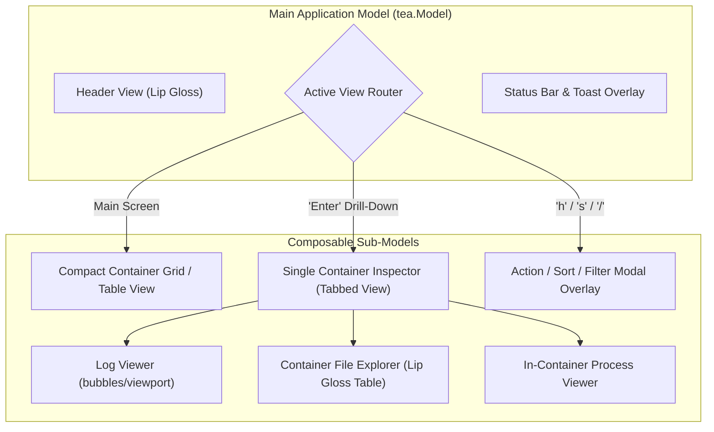
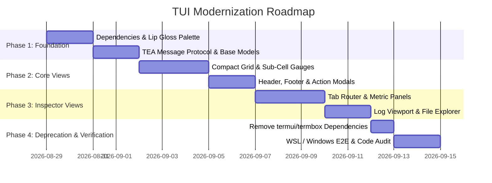

# TUI Modernization Architecture & Alignment Plan

This document outlines the architectural blueprint and phased implementation plan to modernize the `ctop` Terminal User Interface (TUI) stack, aligning it with the modern Charm ecosystem (**Bubble Tea** + **Lip Gloss**) as implemented in [`netping`](file:///e:/data/devel/build/code/private/netping/).

---

## 1. Executive Summary & Motivation

The current `ctop` TUI relies on `github.com/gizak/termui/v3` and the unmaintained `github.com/nsf/termbox-go` backend. While functional, this legacy stack presents key architectural and operational limitations:

- **Legacy Win32 Console API Handles**: `termbox-go` uses low-level Win32 console handles that are susceptible to `"The handle is invalid"` panics in Windows pipes, CI runners, and SSH sessions.
- **Imperative Coordinate Calculations**: Widgets manually calculate 2D bounding boxes (`SetRect(x1, y1, x2, y2)`), leading to rigid layout code and ghost artifacting on resize.
- **Limited Visual Palette**: Restricted to basic 8/16 ANSI terminal colors with coarse ASCII block characters for gauges.
- **Global Synchronization Overhead**: Imperative rendering loops require global mutex locking across views.

### The Target Architecture (Charm Ecosystem)

Aligning with `netping` replaces imperative cell rendering with **The Elm Architecture (TEA)**:

```
┌─────────────────────────────────────────────────────────────┐
│                    tea.Program (Event Loop)                 │
└──────────────────────────────┬──────────────────────────────┘
                               │
            ┌──────────────────┴──────────────────┐
            ▼                                     ▼
   tea.Model.Update(msg)                 tea.Model.View()
   - Handles tea.KeyMsg, ticks,          - Pure string builder
     metrics, and resize events          - Lip Gloss declarative styles
   - Returns updated model & commands    - TrueColor (24-bit) & sub-cell bars
```

---

## 2. Visual & Technical Comparison

| Dimension | Current Stack (`termui` / `termbox`) | Target Stack (`Bubble Tea` / `Lip Gloss`) |
| :--- | :--- | :--- |
| **Architecture** | Imperative 2D cell coordinate math | Declarative Functional State Machine (The Elm Architecture) |
| **Color Rendering** | 8/16 ANSI palette | **24-bit TrueColor (16.7M colors)** + 256-color adaptive fallback |
| **Metric Gauges** | Coarse single-character full blocks (`■`) | **High-resolution sub-cell fractional bars** (`▏▎▍▌▋▊▉█`) |
| **Borders & Badges** | Rigid ASCII/single-line box borders | **Rounded borders** (`╭─╮`), pill badges (`[ RUNNING ]`), soft drop shadows |
| **Windows Support** | Raw Win32 Console API handles | Native Virtual Terminal Processing (`x/term`, `coninput`) |
| **Mouse Interaction** | Limited coordinate interception | Full mouse wheel & click support in log viewports and tabs |
| **Testability** | Requires real terminal / PTY mocking | **100% pure unit testable** via `Update(msg)` and `View()` assertions |

---

## 3. Component Architecture & Mapping



### Component Migration Specifications

1. **Compact Grid (`internal/cwidgets/compact`) $\rightarrow$ `Lip Gloss Table / Rows`**:
   - High-performance, declarative row builder using `lipgloss.JoinHorizontal` and `lipgloss.NewStyle()`.
   - Dynamic column sorting (`cpu`, `mem`, `net`, `io`, `pids`, `uptime`, `compose`).
   - Fractional sub-cell Unicode gauges for CPU and Memory percentages.
2. **Container Inspector (`internal/cwidgets/single`) $\rightarrow$ `InspectorModel`**:
   - Tab navigation bar with numbered shortcut access:
     `[1] Info` | `[2] CPU` | `[3] Mem` | `[4] Net` | `[5] IO` | `[6] Logs` | `[7] Files` | `[8] Top` | `[9] Diff` | `[0] Gen`
   - Real-time container log streaming integrated with `github.com/charmbracelet/bubbles/viewport`.
3. **Header & Status Bar (`internal/widgets`) $\rightarrow$ `HeaderModel` & `FooterModel`**:
   - Cluster and host aggregation summary (total containers, running, paused, stopped).
   - Dynamic filter string pill badge and contextual navigation legend.
4. **Interactive Action Modals (`internal/widgets/menu`) $\rightarrow$ `ModalOverlay`**:
   - Centered, floating Lip Gloss dialogs for container state actions (`Start`, `Stop`, `Pause`, `Restart`, `Exec`), sort picker, and text input prompts.

---

## 4. Design System & Color Palette

Aligned with the soft, high-contrast palette used in `netping`:

```go
var (
	ColorBorder   = lipgloss.Color("#3B4252") // Slate Blue
	ColorHeader   = lipgloss.Color("#ECEFF4") // Bright White
	ColorDim      = lipgloss.Color("#4C566A") // Muted Slate
	ColorCyan     = lipgloss.Color("#88C0D0") // Frost Cyan
	ColorTeal     = lipgloss.Color("#8FBCBB") // Soft Teal
	ColorGreen    = lipgloss.Color("#A3BE8C") // Emerald Green
	ColorRed      = lipgloss.Color("#BF616A") // Coral Red
	ColorAmber    = lipgloss.Color("#EBCB8B") // Soft Amber
	ColorDivider  = lipgloss.Color("#2E3440") // Inner Divider
)
```

---

## 5. Phased Implementation Roadmap



### Phase 1: Foundation & Design System
- Add `github.com/charmbracelet/bubbletea`, `github.com/charmbracelet/lipgloss`, and `github.com/charmbracelet/bubbles` to `go.mod`.
- Create `internal/theme/palette.go` defining adaptive Lip Gloss styles for both dark and light terminal environments.
- Define core `tea.Msg` types (`MetricTickMsg`, `ContainerUpdateMsg`, `FilterChangeMsg`, `LogLineMsg`, `ErrorToastMsg`).

### Phase 2: Compact Grid & Main Loop
- Implement `CompactGridModel` handling scrolling, selection, pagination, and multi-field sorting.
- Create sub-cell Unicode bar renderer (`pkg/tui/gauge.go`) for smooth percentage visualizations.
- Build floating overlay modals for container actions (`Start`, `Stop`, `Exec`, `Pause`) and filter inputs.

### Phase 3: Single Container Inspector
- Implement tab router in `InspectorModel`.
- Integrate `bubbles/viewport` for high-throughput container log viewing with mouse wheel scrolling.
- Build Lip Gloss table views for in-container process monitoring (`top`) and directory navigation.

### Phase 4: Deprecation, Validation & Cleanup
- Safely remove `github.com/gizak/termui/v3` and `github.com/nsf/termbox-go` from dependencies.
- Verify 100% test pass rate across WSL Linux and Windows native environments.
- Run multi-stage code audit (`code_audit.sh --auto --fix`) to ensure complete compliance across linting, SAST, and security controls.
