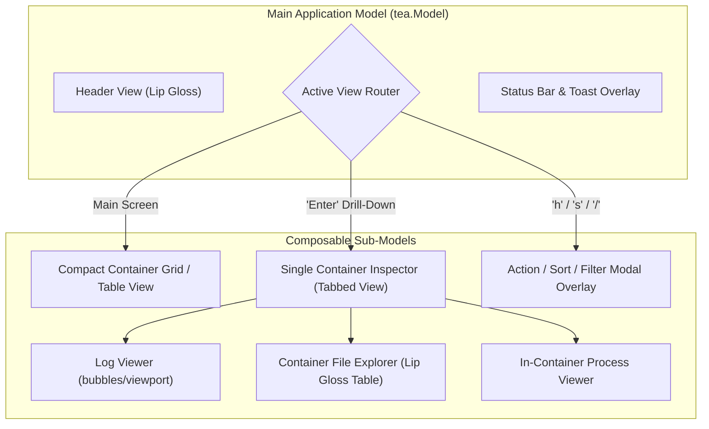
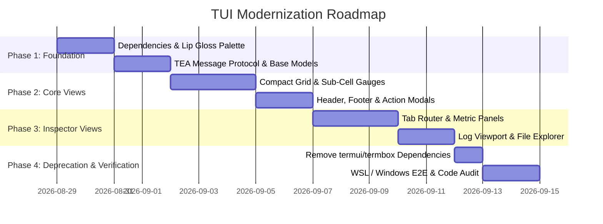

# TUI Modernization Architecture: `tview` + `tcell/v2`

This document outlines the architectural blueprint and implementation specification for the modernized `ctop` Terminal User Interface (TUI) stack, utilizing **`tview`** and **`tcell/v2`** with an executive corporate color palette.

---

## 1. Executive Summary & Architectural Motivation

The previous `termui`/`termbox-go` and string-concatenation stacks presented critical limitations:
- **`termbox-go`**: Susceptible to Win32 console handle errors in Windows pipes and SSH sessions.
- **String-Concatenation (`View() string`)**: Vulnerable to line-wrapping and scrollback drift on variable window sizes and floating overlays.

### The Target Architecture (`tview` + `tcell/v2`)

`tview` on top of `tcell/v2` operates on an in-memory **2D Screen Cell Buffer with hardware double buffering**:

```
┌─────────────────────────────────────────────────────────────┐
│                 tview.Application (Event Loop)              │
│                Driven by tcell.Screen (2D Buffer)           │
└──────────────────────────────┬──────────────────────────────┘
                               │
            ┌──────────────────┴──────────────────┐
            ▼                                     ▼
     tview.Pages (Root)                    tview.Table / Flex
  - Native floating modals              - Fixed column headers
  - Background preserved                - Built-in scroll & clamp
  - Zero line-wrap shifts               - TrueColor (24-bit) palette
```

---

## 2. Executive Corporate Palette

| Token | Hex Code | Role | Description |
| :--- | :--- | :--- | :--- |
| **`Header / Accent Blue`** | `#3A96DD` | Primary Accent | Main column headers, active borders, section titles |
| **`Selection Blue`** | `#005F87` | Selection | High-contrast cursor row highlight |
| **`Status OK / Healthy`** | `#00E676` | Success | Emerald green status glyph and healthy indicators |
| **`Status Warn`** | `#FFB300` | Warning | Amber warning badge for paused containers |
| **`Status Danger / Stop`**| `#E53935` | Error / Inactive | Muted crimson red for stopped/exited containers |
| **`Text Primary`** | `#FFFFFF` | Content | Bright crisp text for active rows and keys |
| **`Text Secondary / Dim`**| `#A0AEC0` | Inactive / Muted | Muted slate gray for stopped containers and descriptions |
| **`Border Dim`** | `#2D3748` | Dividers | Subtle dark separator lines |
| **`Background`** | `#121417` | Canvas | Deep dark background |



### Component Migration Specifications

1. **Compact Grid (`internal/cwidgets/compact`) $\rightarrow$ `Lip Gloss Table / Rows`**:
   - High-performance, declarative row builder using `lipgloss.JoinHorizontal` and `lipgloss.NewStyle()`.
   - Dynamic column sorting (`cpu`, `mem`, `net`, `io`, `pids`, `uptime`, `compose`).
   - Fractional sub-cell Unicode gauges for CPU and Memory percentages.
2. **Container Inspector (`internal/cwidgets/single`) $\rightarrow$ `InspectorModel`**:
   - Tab navigation bar with numbered shortcut access:
     `[1] Info` | `[2] CPU` | `[3] Mem` | `[4] Net` | `[5] IO` | `[6] Logs` | `[7] Files` | `[8] Top` | `[9] Diff` | `[0] Gen`
   - Real-time container log streaming integrated with `github.com/charmbracelet/bubbles/viewport`.
3. **Header & Status Bar (`internal/widgets`) $\rightarrow$ `HeaderModel` & `FooterModel`**:
   - Cluster and host aggregation summary (total containers, running, paused, stopped).
   - Dynamic filter string pill badge and contextual navigation legend.
4. **Interactive Action Modals (`internal/widgets/menu`) $\rightarrow$ `ModalOverlay`**:
   - Centered, floating Lip Gloss dialogs for container state actions (`Start`, `Stop`, `Pause`, `Restart`, `Exec`), sort picker, and text input prompts.

---

## 4. Enterprise-Grade Design System & Sober Color Palette

To ensure a polished, professional, and non-flashy appearance across both the main grid and deep-inspection views, the TUI uses a **sober, low-saturation Nord/Slate enterprise palette**. High-saturation "neon" colors are replaced with tailored, muted tones that provide clear legibility, high contrast, and cohesive hierarchy:

### A. Semantic Color Palette Tokens

```go
var (
	// Background & Structural Borders
	ColorBg         = lipgloss.Color("#1E222B") // Deep Slate Charcoal (Base)
	ColorBorder     = lipgloss.Color("#3B4252") // Muted Slate (Card & Container Borders)
	ColorBorderDim  = lipgloss.Color("#2E3440") // Subtle Inner Separator / Dividers
	
	// Typography & Content Hierarchy
	ColorTextPrimary   = lipgloss.Color("#ECEFF4") // Crisp Off-White (Primary Values & Headings)
	ColorTextSecondary = lipgloss.Color("#9DA5B4") // Muted Cool Grey (Labels, Keys, Subtitles)
	ColorTextMuted     = lipgloss.Color("#5C6370") // Dim Slate (Inactive Tabs, Footers, Timestamps)
	
	// State & Status Indicators (Muted, Sober Accents)
	ColorStatusOk     = lipgloss.Color("#78A987") // Soft Sage Green (Running / Healthy)
	ColorStatusWarn   = lipgloss.Color("#D0A362") // Warm Ochre / Amber (Paused / High Load)
	ColorStatusDanger = lipgloss.Color("#C26569") // Desaturated Brick Coral (Exited / Error)
	ColorStatusInfo   = lipgloss.Color("#6C88A8") // Slate Blue (Info / Neutral)

	// Metric Subsystems & Visual Graphs
	ColorMetricCpu    = lipgloss.Color("#6FA2A8") // Glacier Teal (CPU Utilization)
	ColorMetricMem    = lipgloss.Color("#6C88A8") // Muted Cobalt (Memory Allocation)
	ColorMetricNetRx  = lipgloss.Color("#7E9F85") // Sage Olive (Network Ingress)
	ColorMetricNetTx  = lipgloss.Color("#8B7FA8") // Slate Violet (Network Egress)
	ColorMetricIO     = lipgloss.Color("#8294A0") // Steel Grey (Disk I/O Reads & Writes)
)
```

### B. Details & Inspection View Styling Rules

1. **Inspector Tab Bar (`Overview`, `Mounts`, `Network`, `Env`, `Top`, `Diff`, `Files`)**:
   - Inactive tabs: Sober muted text (`#5C6370`) with no background.
   - Active tab: Subtle background fill (`#2E3440`), soft off-white text (`#ECEFF4`), and a clean bottom border indicator (`#6FA2A8`), eliminating garish full-fill highlight blocks.
2. **Process Top & Environment Variables**:
   - Key-value pairs rendered with muted grey keys (`#9DA5B4`) and crisp white values (`#ECEFF4`).
   - Masked secrets rendered in soft muted grey (`•••••••••••• [masked]`).
   - Process tables styled with thin horizontal grid lines (`#2E3440`) and right-aligned tabular numbers.
3. **Filesystem Explorer & Diffs**:
   - File trees use clean Unicode branch markers (`├──`, `└──`) with subtle directory badges (`[DIR]`).
   - Diffs use muted pastel tints (soft sage `#78A987` for additions, soft brick `#C26569` for deletions) rather than harsh solid background fills.
4. **Adaptive Dark/Light Terminal Support**:
   - Automatic terminal background brightness detection (`lipgloss.HasDarkBackground()`) with an inverted high-contrast enterprise light palette (warm ivory `#F5F6F8`, slate charcoal `#2C323C`).

---

## 5. Phased Implementation Roadmap



### Phase 1: Foundation & Design System
- Add `github.com/charmbracelet/bubbletea`, `github.com/charmbracelet/lipgloss`, and `github.com/charmbracelet/bubbles` to `go.mod`.
- Create `internal/theme/palette.go` defining adaptive Lip Gloss styles for both dark and light terminal environments.
- Define core `tea.Msg` types (`MetricTickMsg`, `ContainerUpdateMsg`, `FilterChangeMsg`, `LogLineMsg`, `ErrorToastMsg`).

### Phase 2: Compact Grid & Main Loop
- Implement `CompactGridModel` handling scrolling, selection, pagination, and multi-field sorting.
- Create sub-cell Unicode bar renderer (`pkg/tui/gauge.go`) for smooth percentage visualizations.
- Build floating overlay modals for container actions (`Start`, `Stop`, `Exec`, `Pause`) and filter inputs.

### Phase 3: Single Container Inspector
- Implement tab router in `InspectorModel`.
- Integrate `bubbles/viewport` for high-throughput container log viewing with mouse wheel scrolling.
- Build Lip Gloss table views for in-container process monitoring (`top`) and directory navigation.

### Phase 4: Deprecation, Validation & Cleanup
- Safely remove `github.com/gizak/termui/v3` and `github.com/nsf/termbox-go` from dependencies.
- Verify 100% test pass rate across WSL Linux and Windows native environments.
- Run multi-stage code audit (`code_audit.sh --auto --fix`) to ensure complete compliance across linting, SAST, and security controls.

---

## 6. Keybinding & Feature Parity Matrix

All existing interactive keyboard controls are strictly preserved in the new Bubble Tea event model:

| Keybinding | Action | Target `tea.Model` Handler |
| :--- | :--- | :--- |
| `↑` / `k` / `↓` / `j` | Move selection cursor up / down | `grid.CursorUp()`, `grid.CursorDown()` |
| `PageUp` / `PageDown` | Fast scroll by page height | `grid.PageUp()`, `grid.PageDown()` |
| `<Enter>` | Open single container inspector drill-down | Switch active view router to `InspectorModel` |
| `h` / `?` | Open interactive help overlay | Render `HelpOverlayModel` |
| `s` | Open sort field selection menu | Render `SortOverlayModel` |
| `r` | Reverse active container sort order | Toggle sort direction in `grid.Model` |
| `o` | Open container lifecycle action menu | Render `ActionOverlayModel` (`Start`, `Stop`, `Pause`, `Exec`, `Delete`) |
| `f` | Quick filter toggle (All vs Active running only) | Update filter predicate in `grid.Model` |
| `/` | Open live interactive search & regex input | Focus `bubbles/textinput` filter bar |
| `e` | Export container telemetry snapshot to JSON | Trigger async file export command |
| `c` | Copy container ID / name / logs to system clipboard | Trigger clipboard command via `atotto/clipboard` |
| `u` | Toggle secret masking (`••••••••••••` vs plaintext) | Update `maskSecrets` toggle in inspector |
| `1` – `0` | Direct tab navigation in container inspector | Switch tab index in `InspectorModel` |
| `q` / `<Escape>` / `Ctrl+C` | Back to grid or clean exit application | Send `tea.Quit` or return to parent view |

---

## 7. Headless & Web Telemetry Decoupling Guarantee

- **Independent Execution**: When invoked with `--headless --web <addr>`, `ctop` bypasses `tea.NewProgram` entirely and executes as a pure headless HTTP/SSE daemon via standard `os.Signal` notification channels.
- **Zero UI Dependency in `pkg/*`**: Core telemetry collection, container management, Docker context resolution, and web streaming remain 100% isolated from TUI frameworks.

